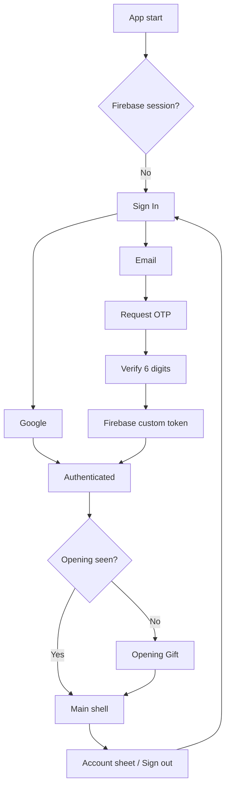

# Auth Module Context

Last updated: 2026-08-08

## Status

- Design handoff: **đã duyệt**.
- Flutter presentation/state/router: **đã triển khai**.
- Firebase/Google adapter: **đã triển khai, chưa có runtime config thật trong Git**.
- Email OTP adapter: **đã triển khai theo contract tạm thời, backend/OpenAPI chưa phát hành**.
- Partner onboarding và local-data migration: **chưa triển khai, là module riêng**.

References:

- `docs/designs/love-journal-auth-handoff.html`
- `docs/designs/love-journal-auth-preview.png`
- `lib/src/features/auth/`
- `.context/love-journal-context/plans/managed-balanced-backend.md`

## Scope

Auth chịu trách nhiệm chọn phương thức đăng nhập, khôi phục session, Google sign-in, request/verify Email OTP, cung cấp auth state cho router, nhận diện tài khoản tối thiểu và sign-out.

Auth không tự tạo/mời partner, chọn couple space, quyết định membership, migrate dữ liệu local hoặc cung cấp Settings/Profile đầy đủ.

## Implemented Flow



Routes:

```txt
/auth/sign-in
/auth/email
/auth/email/otp
```

GoRouter là owner của redirect. Screens chỉ phát intent qua Riverpod controller. Deep link vào journal khi signed out quay về Sign In; authenticated user mở `/auth/*` được đưa về Opening/Home.

## UI States

- Sign In dùng anniversary image, privacy signal, neutral Google action, rose Email action và legal copy.
- Google loading khóa cả hai action; cancel/network/provider/config errors hiển thị inline.
- Email có một field thật, local validation và backend error inline.
- OTP có một numeric input thật với sáu ô hiển thị, resend countdown, invalid/expired/rate-limit/offline states.
- Account avatar nằm cạnh Recap trên Home; root-level sheet chỉ có identity và sign-out.
- `MediaQuery.disableAnimations` bỏ entrance animation của Sign In.

## Code Boundaries

```txt
lib/src/features/auth/
  domain/
    entities/auth_entities.dart
    repositories/auth_repository.dart
  data/
    data_sources/auth_api_data_source.dart
    repositories/firebase_auth_repository.dart
    repositories/email_otp_repository_impl.dart
    repositories/development_auth_repositories.dart
  application/
    auth_providers.dart
    auth_controller.dart
    email_otp_controller.dart
  presentation/
    auth_localizations.dart
    components/
    screens/
```

`AuthController` sở hữu Firebase session/Google/custom-token/sign-out. `EmailOtpController` sở hữu challenge/request/resend/verify. HTTP/Firebase không xuất hiện trong widgets.

## Runtime Configuration

Tạo file ignored `config/auth.dev.json` từ `config/auth.dev.example.json`:

```json
{
  "FIREBASE_API_KEY": "...",
  "FIREBASE_APP_ID": "1:...:android:...",
  "FIREBASE_MESSAGING_SENDER_ID": "...",
  "FIREBASE_PROJECT_ID": "...",
  "FIREBASE_AUTH_DOMAIN": "...firebaseapp.com",
  "FIREBASE_STORAGE_BUCKET": "...firebasestorage.app",
  "GOOGLE_SERVER_CLIENT_ID": "...apps.googleusercontent.com",
  "AUTH_API_BASE_URL": "https://api.example.com",
  "AUTH_DEV_BYPASS": "false"
}
```

Chạy:

```powershell
flutter run --dart-define-from-file=config/auth.dev.json
```

Không có biến nào được hardcode vào source hoặc commit. `FIREBASE_AUTH_DOMAIN` và `FIREBASE_STORAGE_BUCKET` là optional cho auth Android hiện tại; bốn Firebase field đầu và Google server client ID là bắt buộc cho Google sign-in.

## Development Bypass

Để verify UI trước khi có Firebase/backend, đặt:

```json
"AUTH_DEV_BYPASS": "true"
```

Bypass chỉ được chọn khi đồng thời là debug build (`kDebugMode`). Release/profile không dùng nó dù dart-define bị đặt nhầm. Google tạo local development identity; Email OTP nhận mã cố định `123456`. UI hiển thị cảnh báo rõ rằng đây là chế độ phát triển.

## Provisional Email OTP Contract

Client hiện gọi:

```txt
POST /v1/auth/email-otp/request
POST /v1/auth/email-otp/verify
```

Request code body:

```json
{"email":"ban@email.com"}
```

Response tối thiểu:

```json
{
  "challengeId":"...",
  "expiresAt":"2026-08-08T10:10:00Z",
  "resendAvailableAt":"2026-08-08T10:01:00Z",
  "attemptsRemaining":5
}
```

Verify body:

```json
{"challengeId":"...","code":"123456"}
```

Verify response cần `firebaseCustomToken` (client tạm chấp nhận `customToken` để dễ migration). Adapter map 429/rate limit, 410/expired, invalid code, max attempts, network và server errors sang domain failure.

Đây chưa phải released contract. Khi backend publish OpenAPI, generated/approved contract thắng response shape tạm thời này.

## Steps To Enable Real Login

1. Tạo Firebase project hoặc liên kết Firebase với Google Cloud project phù hợp.
2. Thêm Android app `vn.hung.le.lovejournal`; đăng ký SHA-1 và SHA-256 của debug/release certificate.
3. Bật Google provider trong Firebase Authentication và tạo/chọn Web OAuth client dùng làm `GOOGLE_SERVER_CLIENT_ID`.
4. Điền Firebase app values vào local `config/auth.dev.json`; không commit file này.
5. Chạy app với `--dart-define-from-file` và xác nhận Google trả user thật, restart app vẫn khôi phục session, sign-out quay về Sign In.
6. Triển khai backend Foundation/Auth theo Managed-Balanced plan, gồm OTP hash/expiry/max attempts/rate limit và Firebase custom token.
7. Publish OpenAPI qua shared context, cập nhật `AuthApiDataSource` nếu contract khác shape tạm thời.
8. Điền `AUTH_API_BASE_URL`, test request/resend/invalid/expired/success trên thiết bị thật.
9. Thiết kế Onboarding & Partner cùng quyết định migrate dữ liệu local trước khi nối journal vào UID/couple space.

## Known Boundaries

- `hasSeenOpening` và journal draft hiện vẫn là dữ liệu local toàn thiết bị, chưa scope theo UID.
- Terms/Privacy hiện là copy, chưa có route nội dung pháp lý.
- Apple sign-in/iOS Firebase config chưa thuộc milestone Android này.
- Backend disabled-account/frozen-couple semantics chờ contract Auth/Couple.
