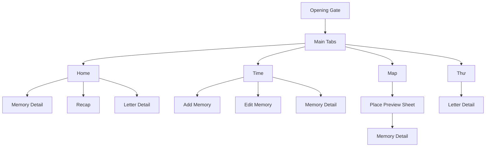
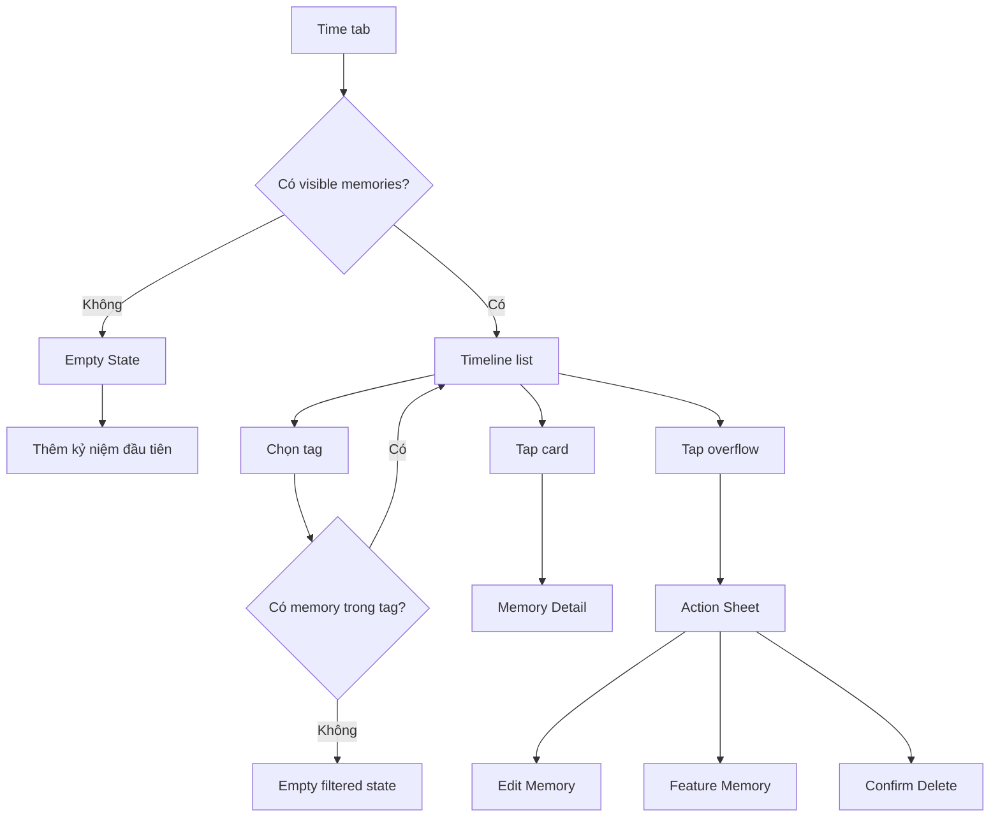
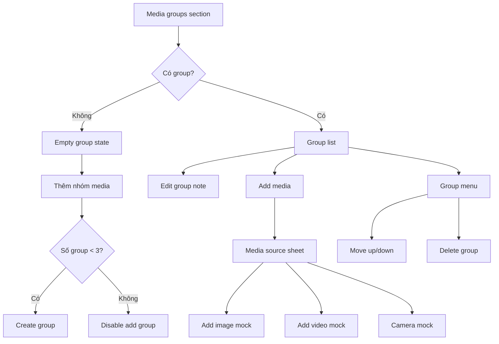

# Mình & Em - Current UI/UX Source Of Truth

Last updated: 2026-07-04  
Implementation status: reflects the current Flutter app after Riverpod, GoRouter, and editable Time module work.

## Purpose

This document describes the UI and UX that the app currently implements.

Use this file when:

- continuing implementation on another device;
- checking whether the app still matches the design direction;
- planning the next UX iteration;
- deciding whether a new feature belongs in the current app surface.

Related design files:

- `love-journal-design-tokens.json`: design tokens.
- `love-journal-figma-handoff.html`: original MVP visual handoff.
- `love-journal-time-management-handoff.html`: Time/Add Memory extension handoff.
- `love-journal-implementation-spec.md`: product and implementation spec.

## Product Feel

`Mình & Em` is a private couple journal. The current app should feel like a warm, intentional archive of shared memories, not a generic productivity tool and not a plain photo gallery.

Core UX principle:

> The memory is the emotional object. Media supports the memory.

The UI should stay:

- warm;
- private;
- readable;
- emotionally soft;
- structured enough to scale into a real product.

Avoid:

- generic social-media gallery patterns;
- overly busy dashboards;
- marketing-style landing pages inside the app;
- one-note color palettes;
- form screens that feel like admin CRUD.

## Visual System

Current visual language comes from `love-journal-design-tokens.json` and is implemented in:

- `lib/src/core/theme/app_tokens.dart`
- `lib/src/core/theme/app_theme.dart`

Core values:

```txt
Base frame: 393 x 852
Screen horizontal padding: 20
Card radius: 8
Primary button height: 52
Secondary button height: 44
Icon button size: 40
Bottom tab bar height: 64
```

Primary colors:

```txt
Paper: #FFF8F2
Paper muted: #F4EBE4
Surface: #FFFFFF
Surface warm: #FFF4EE
Ink: #20191D
Muted: #75686F
Line: #E7D9CF
Rose: #BF5363
Rose dark: #923B4A
Teal: #3F7B84
Moss: #687F6F
Amber: #C5964F
Lavender: #87779D
Night: #19151D
```

Typography:

```txt
Display: Georgia or platform serif
Body: Inter or platform sans
Display XL: 44 / 44
Display L: 34 / 36
Title L: 26 / 29
Title M: 20 / 24
Body L: 16 / 24
Body M: 14 / 21
Body S: 12 / 16
Label: 11 / 14 uppercase
```

Current common styling:

- Warm page gradient background.
- White or warm white cards.
- Subtle border using `AppColors.line`.
- Soft shadows for cards and floating sheets.
- Pill buttons and filter chips.
- Circular icon buttons.
- Bottom sheets with `AppColors.paper` background and rounded top corners.

## Navigation UX

The app uses GoRouter with a `StatefulShellRoute.indexedStack`.

Bottom tabs:

```txt
Home
Time
Map
Thư
```

The bottom tab bar appears only on root tab screens:

```txt
/home
/timeline
/map
/letters
```

The tab bar is hidden on deeper routes:

```txt
/home/memories/:memoryId
/home/letters/:letterId
/home/recap
/timeline/new-memory
/timeline/edit-memory/:memoryId
/timeline/memories/:memoryId
/map/memories/:memoryId
/letters/:letterId
```

Navigation diagram:



## Global States

### Loading

Used while journal data or session preferences are loading.

Current UI:

- warm page scaffold;
- centered rose `CircularProgressIndicator`.

### Error

Used when journal data or session preferences fail.

Current UI:

- warm page scaffold;
- centered `EmptyStateCard`;
- title: `Chưa mở được nhật ký`;
- body: raw error text.

### Opening Gate

If `hasSeenOpening` is false, user is redirected to Opening Gift.

When CTA is tapped:

- `hasSeenOpening` is persisted;
- route navigates to Home.

## Screen: Opening Gift

File:

- `lib/src/features/journal/presentation/screens/opening_gift_screen.dart`

Purpose:

- make first launch feel like opening a private gift;
- establish emotional tone before utility surfaces appear.

Current UI:

- full-screen vertical hero image;
- dark photo overlay;
- safe-area aware content;
- kicker: `Gửi riêng em`;
- large serif title;
- short body copy;
- primary CTA: `Mở món quà`.

UX behavior:

- first launch only;
- CTA completes opening and navigates into Home.

Notes:

- The opening image currently uses `assets/images/anniversary-hero.png`.
- Later, replay can be added from Settings or debug menu.

## Screen: Home

File:

- `lib/src/features/journal/presentation/screens/home_screen.dart`

Purpose:

- emotional dashboard;
- first landing screen after opening;
- not a dense utility dashboard.

Current sections:

1. Top bar
   - kicker: `Chào em`;
   - title: `Mình & Em`;
   - heart icon leading to recap.

2. Hero memory card
   - image from featured memory or fallback hero image;
   - kicker: `Kỷ niệm của tụi mình`;
   - large love day count;
   - subtitle: `Và anh vẫn muốn đi tiếp cùng em.`

3. Stats row
   - number of visible memories;
   - number of places.

4. Featured memory
   - shows `MemoryListCard`;
   - if no visible memory exists, shows empty state:
     - `Chưa có kỷ niệm nổi bật`
     - `Khi thêm kỷ niệm đầu tiên, Home sẽ giữ lại khoảnh khắc đáng nhớ nhất ở đây.`

5. Next letter
   - shows pinned letter or first available letter;
   - empty state if no letter exists.

6. Recap CTA
   - primary button: `Xem recap ba năm`.

UX notes:

- Home now handles an empty memory list safely.
- Featured memory respects soft delete.
- Home still intentionally has one main emotional action: recap.

## Screen: Time

File:

- `lib/src/features/journal/presentation/screens/timeline_screen.dart`

Purpose:

- browse memories chronologically;
- create, edit, soft-delete, and feature memories;
- filter memories by dynamic tag.

Current top bar:

- kicker: `Theo dòng thời gian`;
- title: `Time`;
- search icon button;
- add memory icon button.

Search status:

- Search button exists.
- Search behavior is not implemented yet.

Tag filter UX:

- `Tất cả` is always first.
- Other tags come from `MemoryTag` data.
- Tags are dynamic, including user-created custom tags.
- Selecting a chip filters the timeline in place.

List UX:

- Visible memories only.
- Soft-deleted memories are hidden.
- Timeline spine remains on the left.
- Memory cards animate with fade + slight vertical translate.

Memory card content:

- cover thumbnail;
- title;
- date/place;
- short story;
- tag pill;
- media summary, for example:
  - `8 ảnh · 2 video · 1 lời nhắn`;
- overflow menu.

Memory action sheet:

- title: memory title;
- helper: `Chọn cách chỉnh sửa kỷ niệm này.`;
- actions:
  - `Sửa kỷ niệm`;
  - `Đặt làm kỷ niệm nổi bật`;
  - `Xóa kỷ niệm`.

Delete UX:

- destructive action opens confirmation dialog;
- confirm soft-deletes memory using `deletedAt`;
- deleted memory disappears from Time and Home.

Empty state: no memories

- title: `Chưa có kỷ niệm nào được viết`;
- body: `Bắt đầu bằng một khoảnh khắc nhỏ. Một buổi tối bình thường cũng xứng đáng được giữ lại.`;
- CTA: `Thêm kỷ niệm đầu tiên`.

Empty state: selected tag has no memory

- title: `Chưa có kỷ niệm trong nhãn này`;
- body: `Bạn có thể thêm một kỷ niệm mới vào nhãn đang chọn.`;
- CTA: `Thêm vào nhãn này`.

UX flow:



## Screen: Add/Edit Memory

File:

- `lib/src/features/journal/presentation/screens/memory_form_screen.dart`

Routes:

- `/timeline/new-memory`
- `/timeline/edit-memory/:memoryId`

Purpose:

- create or update one curated memory;
- keep form story-first;
- avoid becoming a generic file/media manager.

The bottom tab bar is hidden on this screen.

### App Bar

Current UI:

- back circular icon;
- centered title:
  - `Kỷ niệm mới`;
  - `Sửa kỷ niệm`;
- save circular icon;
- sticky bottom primary CTA:
  - `Lưu kỷ niệm`;
  - loading label: `Đang lưu...`.

### Main Info Card

Fields:

- `Tiêu đề`;
- `Mô tả`;
- `Thời gian`;
- `Địa điểm`;
- `Ghi chú`;
- `Lời nhắn cho khoảnh khắc này`.

Validation:

- title is required;
- date is required;
- at least one meaningful body element must exist:
  - description,
  - note,
  - voice message,
  - image,
  - video.

### Lời Nhắn Cho Khoảnh Khắc Này

This is the current UX replacement for a generic `Audio` field.

Empty state:

- title: `Chưa có lời nhắn`;
- helper: `Ghi âm mới hoặc chọn một đoạn audio có sẵn trong máy.`;
- CTA: `Thêm lời nhắn`.

Source sheet:

- title: `Thêm lời nhắn`;
- actions:
  - `Chọn từ máy`;
  - `Ghi âm mới`.

Recorder sheet:

- title: `Lời nhắn cho khoảnh khắc này`;
- circular mic visual;
- timer mock: `00:34`;
- waveform/player mock;
- actions:
  - `Hủy ghi âm`;
  - `Lưu lời nhắn`.

List item:

- play icon;
- title or file name;
- source label:
  - `Ghi âm`;
  - `Từ máy`;
- duration;
- delete icon.

Limits:

- MVP allows up to 3 voice messages per memory.

Current implementation note:

- File picking and recording are mocked.
- Mock URI format: `mock://...`.
- Native implementation should be added later behind service abstractions.

### Tag Selector

Current behavior:

- uses wrap/flex layout;
- each chip sizes to its text;
- chips flow horizontally and wrap to next line;
- custom tag names should not overflow the parent;
- selected tag is highlighted using `AppFilterChip`.

Actions:

- select existing tag;
- tap `+ Tạo nhãn`;
- bottom sheet opens;
- enter custom tag name;
- save tag;
- new tag is selected.

Important rule:

- `Tất cả` is not stored as a tag.
- `Tất cả` exists only on the Time filter.

### Media Groups

Purpose:

- organize photos/videos into story segments;
- each group can have its own note.

Current behavior:

- groups are dynamic;
- max 3 groups per memory for MVP;
- group counter is shown:
  - `0/3 nhóm`;
  - `1/3 nhóm`;
  - `2/3 nhóm`;
  - `3/3 nhóm`.

Empty state:

- title: `Chưa có nhóm media`;
- helper: `Tạo nhóm đầu tiên rồi thêm ảnh/video vào đoạn câu chuyện đó.`;
- CTA: `Thêm nhóm media`.

Group card:

- runtime label, for example `Nhóm media · 1/3`;
- helper: `Ảnh và video cùng một đoạn câu chuyện`;
- note text field;
- grid with mixed image/video items;
- add media tile;
- item count footer;
- action menu.

Group actions:

- add media;
- move group up;
- move group down;
- delete group.

Media source sheet:

- `Thêm ảnh từ thư viện`;
- `Thêm video từ thư viện`;
- `Chụp hoặc quay mới`.

Current implementation note:

- Image/video picking is mocked.
- Mock media uses `AppAssets.heroImage`.
- Video is represented by a thumbnail plus play icon.

Media group flow:



## Screen: Memory Detail

File:

- `lib/src/features/journal/presentation/screens/memory_detail_screen.dart`

Purpose:

- let one memory breathe;
- show the story, cover, quote, voice messages, and media groups.

Current UI:

1. Cover media
   - height around 324;
   - hero image transition tag;
   - photo overlay;
   - back and favorite circular buttons.

2. Detail sheet
   - date/place;
   - title;
   - story split into shorter blocks when long;
   - favorite quote if available;
   - `Lời nhắn cho khoảnh khắc này` if voice messages exist.

3. Additional content
   - message for her quote if available;
   - media groups if available;
   - old flat media carousel fallback if no groups.

Voice message display:

- section label;
- voice player rows with duration;
- playback remains visual/mock.

Media group display:

- group note appears before its carousel;
- carousel shows group items;
- falls back to flat `memory.media` when no groups exist.

## Screen: Map

File:

- `lib/src/features/journal/presentation/screens/map_screen.dart`

Purpose:

- turn memories into places and a journey.

Current UI:

- top bar:
  - kicker: `Những nơi mình qua`;
  - title: `Bản đồ`;
  - location pin icon;
- static stylized map canvas;
- route-like painted lines;
- place pins;
- place labels.

Interaction:

- tap pin opens `PlacePreviewSheet`;
- bottom sheet shows place preview;
- opening a place opens first memory for that place if available.

Implementation note:

- This is not a real map SDK yet.
- Google Maps or Mapbox can be added later.

## Screen: Letters

File:

- `lib/src/features/journal/presentation/screens/letters_screen.dart`

Purpose:

- private time capsule.

Current UI:

- top bar:
  - kicker: `Dành cho em`;
  - title: `Những lá thư`;
  - mail icon;
- list of letter cards;
- bottom tab bar visible.

Letter states:

- `open`;
- `locked`;
- `opened`.

Interaction:

- tapping open/opened letter navigates to Letter Detail;
- tapping locked letter opens bottom sheet explaining unlock date/countdown.

Locked letter UX:

- body is not exposed;
- card shows locked/countdown state only;
- bottom sheet explains when it opens.

## Screen: Letter Detail

File:

- `lib/src/features/journal/presentation/screens/letter_detail_screen.dart`

Purpose:

- slow reading moment;
- emotional text-first surface.

Current UI:

- top action row:
  - back;
  - heart/favorite visual action;
- envelope/paper visual style;
- occasion;
- title;
- letter body;
- primary CTA style button.

UX notes:

- Reads like a private note, not a content article.
- Keep paragraphs breathable.

## Screen: Recap

File:

- `lib/src/features/journal/presentation/screens/recap_screen.dart`

Purpose:

- emotional peak / anniversary summary.

Current UI:

- back button;
- hero memory card;
- stats grid:
  - days;
  - places;
  - photos;
  - letters;
- final quote block;
- CTA: `Cùng anh viết tiếp nhé?`.

Empty-safe behavior:

- if there is no featured memory, fallback hero image is used.
- photo count uses visible memories only.

## Components Currently Used

Core presentation components:

- `AppScaffold`
- `TopBar`
- `EmptyStateCard`
- `SectionHeader`
- `AppCircleButton`
- `PrimaryButton`
- `SecondaryButton`
- `AppFilterChip`
- `AppBottomTabBar`
- `HeroMemoryCard`
- `MemoryListCard`
- `TimelineSpine`
- `MemoryThumbnail`
- `AssetCoverImage`
- `MediaCarousel`
- `QuoteBlock`
- `VoiceNotePlayer`
- `StatCard`
- `LetterCard`
- `PlacePreviewSheet`

Component behavior notes:

- `AppScaffold` provides warm page gradient.
- `AppBottomTabBar` is a floating, blurred pill nav.
- `AppFilterChip` is used both for Time filters and form tag chips.
- `MemoryListCard` now supports optional tag label, media summary, and more action.
- `TimelineSpine` supports optional metadata and overflow actions.
- `VoiceNotePlayer` is visual-only for now.

## Bottom Sheets

Bottom sheets are a core UX surface in the current app.

Used for:

- locked letter explanation;
- place preview;
- memory action menu;
- create custom tag;
- voice message source;
- recorder mock;
- media source.

Current visual style:

- background: `AppColors.paper`;
- rounded top corners;
- no transparent background;
- optional handle;
- warm copy;
- action rows/cards.

## Current Data/UX Constraints

Local-first:

- app works offline with bundled assets and local draft data.

Current persistence:

- app session uses SharedPreferences;
- editable memories/tags use SharedPreferences draft JSON.

Current mock limitations:

- media picker is mocked;
- audio picker is mocked;
- recorder is mocked;
- video playback is mocked;
- voice playback is mocked;
- Time search is not implemented;
- no undo/trash UI for soft delete;
- no account/cloud sync.

## UX Rules To Preserve

1. Time is not just a list of photos.
2. Add/Edit Memory must remain story-first.
3. `Lời nhắn cho khoảnh khắc này` replaces a generic `Audio` field.
4. Media groups are dynamic and limited to 3 for MVP.
5. `Tất cả` is a UI filter, not stored as a tag.
6. Custom tags must appear as Time filter chips.
7. Bottom sheets must have visible warm background.
8. Empty states should be emotional and actionable.
9. Soft delete should hide memories without destroying data.
10. Keep the app local-first until auth/sync is intentionally designed.

## UI/UX Verification Checklist

Use this checklist after major UI changes:

- Opening appears only before `hasSeenOpening`.
- Home does not crash when there are no memories.
- Home uses visible memory count.
- Time title is `Time`, kicker is `Theo dòng thời gian`.
- Time has `Tất cả` plus dynamic tag chips.
- Time empty state has CTA.
- Time filtered empty state has CTA.
- Memory card overflow opens action sheet with background.
- Delete action asks for confirmation.
- Add Memory hides bottom tab bar.
- Edit Memory hides bottom tab bar.
- Tag selector wraps chips to next line.
- Custom tag appears in form and Time filter.
- Voice message section is named `Lời nhắn cho khoảnh khắc này`.
- No separate generic `Audio` field appears.
- Media groups show `0/3`, `1/3`, `2/3`, `3/3` style limit.
- Add group is disabled/hidden at 3 groups.
- Memory Detail shows voice messages and media groups.
- Locked letters do not expose body content.
- Map bottom sheet has visible background.
- Recap works even with no featured memory.

## Next UI/UX Work

Recommended next design/implementation passes:

1. Add widget tests for Time empty, add memory, custom tag, and soft delete.
2. Design real permission states for microphone, photos, and camera.
3. Replace mock audio/media with native services.
4. Add Time search UX.
5. Add undo or trash recovery after soft delete.
6. Add accessibility pass:
   - semantic labels;
   - text scale;
   - contrast checks;
   - touch targets.
7. Add responsive checks for smaller Android devices.

