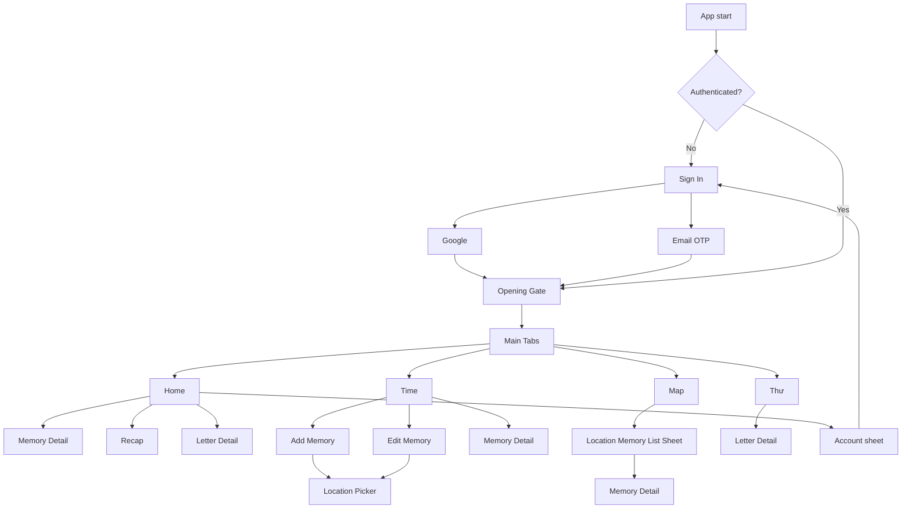
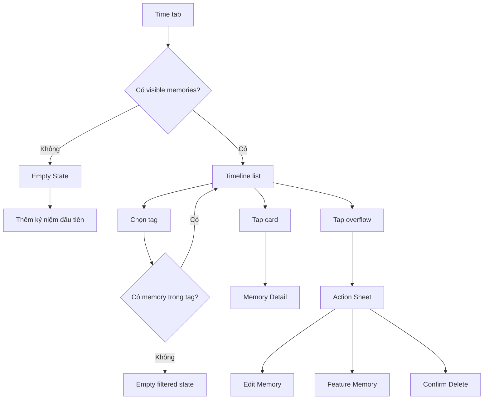
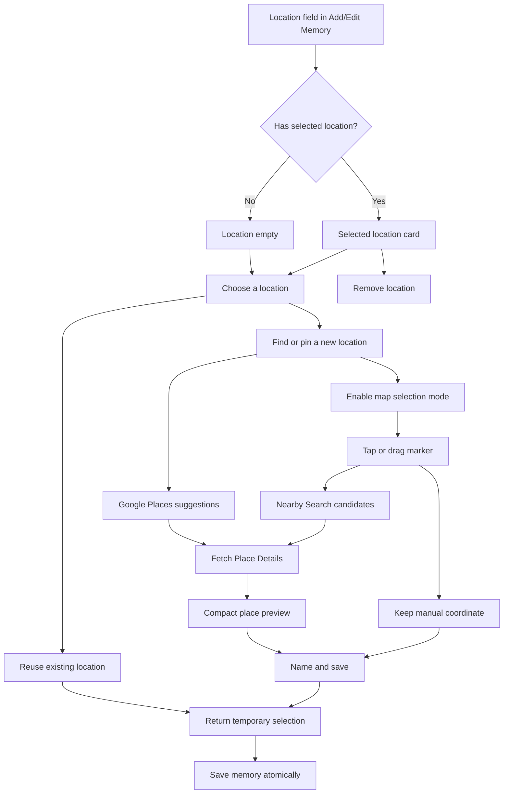
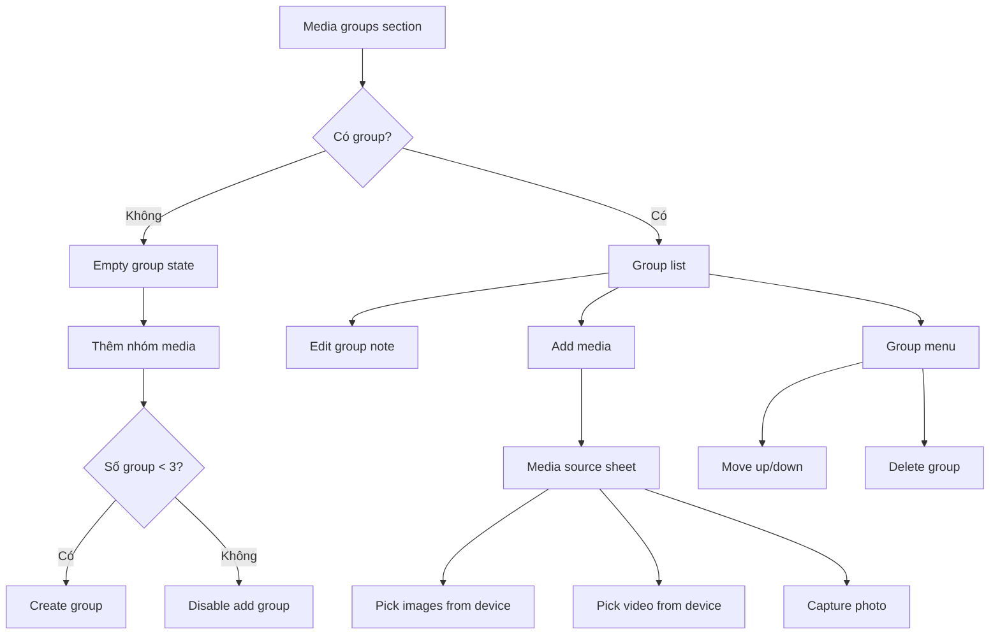

# Mình & Em - Current UI/UX Source Of Truth

Last updated: 2026-08-08
Implementation status: reflects the implemented Auth client and gate, Home "Nhật ký sống" stage 1, visual Memory Composer, native local attachments, static video thumbnails and viewer playback, interactive Location Picker with Nearby Search/Place Details, read-only memory-derived Map, empty bundled memory/place seeds, and direct Places API (New) REST for the local-first milestone. Real Firebase credentials and the Email OTP backend remain external setup work.

## Purpose

This document describes both the UI/UX currently implemented by Flutter and any approved target behavior that is still pending native/backend work. Sections use these labels:

- **Implemented:** present in the current Flutter code.
- **Approved target:** reviewed in Figma and intended behavior when the remaining native/backend dependency is available.

Use this file when:

- continuing implementation on another device;
- checking whether the app still matches the design direction;
- planning the next UX iteration;
- deciding whether a new feature belongs in the current app surface.

Related design files:

- `love-journal-design-tokens.json`: design tokens.
- `love-journal-figma-handoff.html`: original MVP visual handoff.
- `love-journal-home-living-journal-handoff.html`: implemented Home stage-1 handoff.
- `love-journal-home-living-journal-preview.png`: rendered Home handoff preview.
- `love-journal-memory-composer-handoff.html`: implemented visual Memory Composer handoff.
- `love-journal-time-management-handoff.html`: Time/Add Memory extension handoff.
- `love-journal-auth-handoff.html`: implemented Auth screen/state handoff.
- `love-journal-auth-preview.png`: rendered Auth handoff preview.
- `love-journal-implementation-spec.md`: product and implementation spec.
- [Figma - Love Journal Map + Memory Location](https://www.figma.com/design/b3zJU0jnS7ZFAaJNX6G5lC): approved Map and Location Picker flow.

## Product Feel

`Mình & Em` is a private couple journal. The current app should feel like a warm, intentional archive of shared memories, not a generic productivity tool and not a plain photo gallery.

Core UX principle:

> The memory is the emotional object. Media supports the memory.

The UI should stay:

- warm;
- private;
- readable;
- emotionally soft;
- structured enough to scale into a real product.

Avoid:

- generic social-media gallery patterns;
- overly busy dashboards;
- marketing-style landing pages inside the app;
- one-note color palettes;
- form screens that feel like admin CRUD.

## Visual System

Current visual language comes from `love-journal-design-tokens.json` and is implemented in:

- `lib/src/core/theme/app_tokens.dart`
- `lib/src/core/theme/app_theme.dart`
- `lib/l10n/app_vi.arb` for user-facing copy

Core values:

```txt
Base frame: 393 x 852
Screen horizontal padding: 20
Card radius: 8
Primary button height: 52
Secondary button height: 44
Icon button size: 40
Bottom tab bar height: 64
```

Primary colors:

```txt
Paper: #FFF8F2
Paper muted: #F4EBE4
Surface: #FFFFFF
Surface warm: #FFF4EE
Ink: #20191D
Muted: #75686F
Line: #E7D9CF
Rose: #BF5363
Rose dark: #923B4A
Teal: #3F7B84
Moss: #687F6F
Amber: #C5964F
Lavender: #87779D
Night: #19151D
```

Typography:

```txt
Display: Georgia or platform serif
Body: Inter or platform sans
Display XL: 44 / 44
Display L: 34 / 36
Title L: 26 / 29
Title M: 20 / 24
Body L: 16 / 24
Body M: 14 / 21
Body S: 12 / 16
Label: 11 / 14 uppercase
```

Current common styling:

- Warm page gradient background.
- White or warm white cards.
- Subtle border using `AppColors.line`.
- Soft shadows for cards and floating sheets.
- Pill buttons and filter chips.
- Filter chips shrink-wrap to their text and wrap like flexbox items when used in forms.
- Circular icon buttons.
- Bottom sheets with `AppColors.paper` background and rounded top corners.

Localization:

- User-facing app copy is routed through Flutter gen-l10n.
- Vietnamese is the current template locale in `lib/l10n/app_vi.arb`.
- Domain/data IDs, route names, JSON keys, asset paths, and mock URIs remain technical strings outside localization.

## Authentication UX

Status: **Implemented in Flutter; real service configuration pending.**

### Sign In

- Full-width anniversary image anchors the first viewport with privacy lock, `Nhật ký riêng của hai đứa`, and `Mình & Em`.
- The warm lower surface contains one neutral Google action and one rose Email action; no marketing carousel or settings content appears here.
- Google loading replaces its mark with a compact progress indicator and disables both sign-in methods until the provider returns.
- Missing config, cancellation, network, provider and rate-limit errors appear inline without discarding local journal data.
- Debug bypass is visibly identified and is impossible in profile/release builds.

### Email

- One email field and one `Gửi mã` CTA keep this path short.
- Invalid email is handled locally at the field; backend/config/network errors appear immediately below it.
- A successful request navigates to OTP while keeping the challenge in Riverpod state.

### Email OTP

- One real numeric input drives six visual cells and platform OTP autofill.
- The screen keeps the destination email visible, shows a resend countdown, and supports invalid, expired, max-attempt, rate-limit and offline states.
- Verification returns a Firebase custom token through the backend adapter, then the auth controller starts the Firebase session.
- In debug bypass only, code `123456` is shown as development guidance.

### Account Sheet

- Home shows the authenticated avatar/initials beside the Recap heart.
- Tap opens a root-navigator sheet above the tab shell with display name, email and `Đăng xuất` only.
- Sign-out clears the provider session and the router returns to Sign In.

The implemented presentation is source-aligned with `love-journal-auth-handoff.html`. Partner pairing, couple selection and local-data migration remain separate future flows.

## Navigation UX

The app uses GoRouter with a `StatefulShellRoute.indexedStack`.

Root auth routes, always outside the tab shell:

```txt
/auth/sign-in
/auth/email
/auth/email/otp
```

Bottom tabs:

```txt
Home
Time
Map
Thư
```

The bottom tab bar appears only on root tab screens:

```txt
/home
/timeline
/map
/letters
```

The tab bar is hidden on deeper routes:

```txt
/home/memories/:memoryId
/home/letters/:letterId
/home/recap
/timeline/new-memory
/timeline/edit-memory/:memoryId
/timeline/new-memory/location
/timeline/edit-memory/:memoryId/location
/timeline/memories/:memoryId
/map/memories/:memoryId
/letters/:letterId
```

Navigation diagram:



## Global States

### Loading

Used while auth session, journal data or session preferences are loading.

Current UI:

- warm page scaffold;
- centered rose `CircularProgressIndicator`.

### Error

Used when an unrecoverable auth initialization, journal data or session preference load fails. Recoverable sign-in/OTP failures remain inline on their own screen.

Current UI:

- warm page scaffold;
- centered `EmptyStateCard`;
- title: `Chưa mở được nhật ký`;
- body: raw error text.

### Opening Gate

After authentication, if `hasSeenOpening` is false, user is redirected to Opening Gift.

When CTA is tapped:

- `hasSeenOpening` is persisted;
- route navigates to Home.

## Screen: Opening Gift

File:

- `lib/src/features/journal/presentation/screens/opening_gift_screen.dart`

Purpose:

- make first launch feel like opening a private gift;
- establish emotional tone before utility surfaces appear.

Current UI:

- full-screen vertical hero image;
- dark photo overlay;
- safe-area aware content;
- kicker: `Gửi riêng em`;
- large serif title;
- short body copy;
- primary CTA: `Mở món quà`.

UX behavior:

- first launch only;
- CTA completes opening and navigates into Home.

Notes:

- The opening image currently uses `assets/images/anniversary-hero.png`.
- Later, replay can be added from Settings or debug menu.

## Screen: Home

Status:

- Implemented: stage 1 "Nhật ký sống".
- Approved visual handoff: `docs/designs/love-journal-home-living-journal-handoff.html`.
- Preview: `docs/designs/love-journal-home-living-journal-preview.png`.

Purpose:

- The emotional front page of the journal.
- It should feel like a living scrapbook, not a utility dashboard or a collection of summary cards.
- It keeps Recap as the primary emotional action while making memories easier to rediscover.

Current sections:

1. Top bar
   - Kicker: `Chào em`.
   - Title: `Mình & Em`.
   - Heart icon opens Recap.

2. Living hero
   - Height: 334 logical pixels.
   - Uses the featured memory, or the first visible memory when none is explicitly featured.
   - Paper layers behind the media create a restrained scrapbook feeling.
   - Shows `Hành trình của tụi mình`, love-day count, `ngày bên nhau`, memory title, date, and location.
   - Image cover renders normally.
   - Video cover renders a static first-frame thumbnail in stage 1; no player or autoplay is created.
   - Tapping the hero opens Recap.
   - If there is no memory, the hero uses the anniversary fallback image and becomes the first-memory prompt.

3. Stats ribbon
   - One continuous horizontal ribbon, not three floating cards.
   - Shows love days, visible-memory count, and unique valid locations.
   - Location count comes from `JournalData.mapLocationGroups.length`, not legacy `places.json`.

4. Recent-memory discovery
   - Kicker: `Gần đây`.
   - Title: `Những mảnh ghép`.
   - PageView contains up to five newest visible memories after excluding the hero memory.
   - `viewportFraction` leaves a visible hint of the next card.
   - Current card scales subtly by page distance; this transform is disabled when Reduce Motion is enabled.
   - Card tap opens Memory Detail.
   - This section is hidden when there are no eligible recent memories.

5. Compact letter section
   - Kicker: `Dành cho em`.
   - Title: `Một lá thư đang đợi`.
   - Uses the pinned letter or next available letter.
   - Keeps locked/opened state and opens Letter Detail on tap.
   - Uses an unframed horizontal strip instead of another large dashboard card.

6. Recap band
   - Wine-colored full-width band titled `Chuyện của tụi mình`.
   - Short supporting copy and `Xem recap ba năm` action.
   - Entire band opens Recap.

Empty memory state:

- Fallback anniversary image remains visually dominant.
- Copy:
  - `Trang đầu tiên`
  - `Mình bắt đầu giữ lại một ngày nhé?`
  - `Một tấm ảnh, một câu chuyện nhỏ, hay chỉ là giọng nói của hai đứa.`
- CTA: `Tạo kỷ niệm đầu tiên`.
- CTA navigates to Add Memory.
- Recent-memory carousel is not shown.

Motion:

- Home owns one 760ms entrance controller.
- Header, hero, stats, recent memories, letter, and recap fade/translate in with short staggered intervals.
- Press feedback uses the existing scale interaction.
- With system Reduce Motion enabled, all entrance content appears immediately and PageView card scaling is disabled.

UX notes:

- Featured and recent-memory data only use visible memories, so soft-deleted memories never appear.
- Home still has one primary emotional action: Recap. The empty-state Add Memory action only replaces it as the immediate next step when the journal is empty.
- Text is capped to stable line counts inside fixed-height hero and carousel surfaces.

Approved but deferred to stage 2:

- Daily-memory selector based on the current date.
- Hero parallax.
- Animated count-up statistics.
- Featured-memory priority inside the discovery carousel.
- Muted hero-video autoplay with pause/offstage/tab lifecycle management.

## Screen: Time

File:

- `lib/src/features/journal/presentation/screens/timeline_screen.dart`

Purpose:

- browse memories chronologically;
- create, edit, soft-delete, and feature memories;
- filter memories by dynamic tag.

Current top bar:

- kicker: `Theo dòng thời gian`;
- title: `Time`;
- search icon button;
- add memory icon button.

Search status:

- Search button exists.
- Search behavior is not implemented yet.

Tag filter UX:

- `Tất cả` is always first.
- Other tags come from `MemoryTag` data.
- Tags are dynamic, including user-created custom tags.
- System tag labels are localized in presentation based on stable system tag IDs.
- Selecting a chip filters the timeline in place.

List UX:

- Visible memories only.
- Soft-deleted memories are hidden.
- Timeline spine remains on the left.
- Memory cards animate with fade + slight vertical translate.

Memory card content:

- cover thumbnail;
- title;
- date/place;
- short story;
- tag pill;
- media summary, for example:
  - `8 ảnh · 2 video · 1 lời nhắn`;
- overflow menu.

Memory action sheet:

- title: memory title;
- helper: `Chọn cách chỉnh sửa kỷ niệm này.`;
- actions:
  - `Sửa kỷ niệm`;
  - `Đặt làm kỷ niệm nổi bật`;
  - `Xóa kỷ niệm`.

Delete UX:

- destructive action opens confirmation dialog;
- confirm soft-deletes memory using `deletedAt`;
- deleted memory disappears from Time and Home.

Empty state: no memories

- title: `Chưa có kỷ niệm nào được viết`;
- body: `Bắt đầu bằng một khoảnh khắc nhỏ. Một buổi tối bình thường cũng xứng đáng được giữ lại.`;
- CTA: `Thêm kỷ niệm đầu tiên`.

Empty state: selected tag has no memory

- title: `Chưa có kỷ niệm trong nhãn này`;
- body: `Bạn có thể thêm một kỷ niệm mới vào nhãn đang chọn.`;
- CTA: `Thêm vào nhãn này`.

UX flow:



## Screen: Add/Edit Memory

File:

- `lib/src/features/journal/presentation/screens/memory_form_screen.dart`

Routes:

- `/timeline/new-memory`
- `/timeline/edit-memory/:memoryId`

Approved child routes:

- `/timeline/new-memory/location`
- `/timeline/edit-memory/:memoryId/location`
- Location Picker is one pushed screen with internal UI states, not eleven separate routes.
- The bottom tab bar remains hidden while the picker is open.

Purpose:

- create or update one curated memory;
- let the user begin from media, one written line, or voice;
- avoid becoming a generic file/media manager.

The bottom tab bar is hidden on this screen.

Design handoff:

- `docs/designs/love-journal-memory-composer-handoff.html`

### Composer Header

Current UI:

- close icon;
- centered new/edit or autosave status;
- edit-title icon;
- generated title below metadata, with an optional user override.

Generated title priority:

1. explicit title override;
2. first non-empty story line;
3. selected location display name;
4. primary tag and date.

### Empty Canvas

When no meaningful content exists, the first viewport shows:

- scrapbook/polaroid visual;
- prompt `Bắt đầu từ điều bạn nhớ`;
- three circular actions:
  - `Ảnh / video` opens the device source sheet;
  - `Viết một dòng` focuses the story editor and keyboard;
  - `Giọng nói` opens import/record choices.

The story editor remains available below the prompt so the user can continue without another step.

### Compact Metadata

The horizontal metadata row contains shrink-wrapped chips for:

- date, defaulting to today;
- one primary tag, defaulting to `Đời thường`;
- optional location.

Tags open a wrap/flex bottom sheet and support custom-tag creation. A selected location chip includes a clear action.

Date opens a custom warm bottom sheet with a stable 6-row/42-cell calendar. Month arrows update the visible month immediately without the heavier default `showDatePicker` page transition.

### Story, Voice, And Media

- One expanding story field replaces separate description/private-note fields in the composer.
- Legacy `note` is merged after `story` when an existing memory is first edited.
- Voice source sheet supports device audio import and microphone recording, maximum 3 messages.
- Native image/video files are copied into app-owned storage before autosave.
- Video source supports selecting several files at once, while the whole memory is limited to 3 videos.
- After video confirmation, a modal warm loading surface blocks conflicting actions while files are prepared/copied. One file uses an indeterminate loading state; multiple files show `x/n` progress.
- If the user selects more videos than the remaining slots, only the allowed files are imported and the skipped count is reported.
- Video tiles show their own static first-frame JPEG thumbnail with a play affordance, including when several videos are in the same segment.
- Tapping any image/video tile opens the full-screen media viewer at that item; the viewer supports horizontal paging, image zoom, and video play/pause without a seek bar.
- Up to 3 media segments can be created.
- Each segment defaults to `Đoạn x`, but that title is directly editable and persisted.
- Each segment also supports an optional note, mixed media, add/remove, delete, and move up/down.
- The persistent bottom toolbar repeats media/story/voice actions and owns the `Lưu kỷ niệm` CTA.

### Draft Recovery

- Meaningful changes debounce-save locally.
- Close/back flushes the current draft immediately.
- Reopening shows a resume/discard sheet.
- Successful memory save removes the temporary composer draft and opens Memory Detail.

Previous location behavior (removed):

- `Địa điểm` was a free-text field.
- The form saved `locationName` only and did not preserve coordinates or a stable location reference.

Current location behavior:

- Replace the free-text field with a tappable Location row/card.
- The empty state communicates that location is optional and offers `Thêm địa điểm`.
- A selected state shows the user-defined display name, address when available, and actions to change or remove the location.
- Tapping the row opens Location Picker and returns a temporary `MemoryLocation` selection to the form.
- The returned selection is committed only when the memory itself is saved.
- Canceling the picker or abandoning the form must not create an orphan location.

Validation:

- title is generated when not manually provided;
- at least one meaningful body element must exist:
  - story,
  - voice message,
  - image,
  - video.

Location does not satisfy the meaningful-body validation on its own.

### Location Picker - Current Implementation

Design source:

- [Figma - Love Journal Map + Memory Location](https://www.figma.com/design/b3zJU0jnS7ZFAaJNX6G5lC)

Purpose:

- attach optional geographic context to a memory;
- keep location creation inside the memory workflow;
- offer accurate Google search without forcing users to position every pin by hand;
- let users explicitly select a point on the map and resolve nearby Google places;
- let the couple use their own emotional name for a place.

Approved design states:

1. `01 / Map empty`
   - no visible memory has a valid location;
   - Map shows an emotional empty state and CTA leading to Time/Add Memory.
2. `02 / Map from memories`
   - read-only map with markers projected from visible memories.
3. `03 / Place memory list`
    - marker bottom sheet lists all visible memories sharing the location.
    - the sheet and modal barrier appear above the persistent bottom tab bar; the tab bar never covers or receives taps through the sheet.
4. `04 / Location empty`
   - Add/Edit Memory has no selected location yet.
5. `05 / Choose a location`
   - user chooses an existing location or starts a new search/manual pin flow.
6. `06 / Reuse existing place`
   - shows locations already referenced by memories and returns the selected internal `locationId`.
7. `07 / Google Places suggestions`
   - autocomplete suggestions appear after a short debounce;
   - results include Google attribution and a manual-pin fallback.
8. `08 / Search result selected`
   - Place Details supplies the exact coordinate, formatted address, type, business status, Google Maps URI, photo reference, and `googlePlaceId`;
   - a compact preview lazily loads one photo and shows its attribution;
   - user confirms `Dùng nơi này` before naming.
9. `09 / Manual pin fallback`
    - map opens in browse mode and pan/zoom never changes the location;
    - a compact segmented control offers `Xem` and `Chọn vị trí`;
    - the toolbar has no descriptive status sentence and shows a separate reset icon only while a marker exists;
    - user enables `Chọn vị trí`, then taps or drags the real selection marker;
    - the explicit coordinate triggers Nearby Search within 150 meters;
   - up to 8 candidates appear as tappable markers plus a synchronized list;
   - selecting a candidate opens the same compact Place Details preview;
   - empty/error Nearby Search keeps `Giữ tọa độ này` available;
   - manual locations do not require `googlePlaceId`.
10. `10 / Name and save`
    - user confirms a required display name;
    - Google name may prefill the field but remains editable;
    - saving returns the selection to Add/Edit Memory, not directly to persistence.
11. `11 / Maps key unavailable`
    - explains that map/search is unavailable without a platform key;
    - app remains stable and allows cancel/back instead of crashing.

Location Picker flow:



Interaction and validation:

- Search begins after at least two trimmed characters and a short debounce.
- Focusing the search input hides the bottom place/context panel immediately; this does not clear the selected place, marker, photo, query, or draft.
- The search/map Stack does not resize when the keyboard opens. Search and suggestions stay anchored below the header, while dismissing the keyboard restores the previous bottom panel.
- Choose and Name keep normal keyboard resize and scrolling behavior.
- One autocomplete session token is reused through suggestion selection, then rotated.
- Place Details is requested only after the user selects an Autocomplete suggestion or Nearby candidate.
- Nearby Search runs only after map tap or marker drag-end while map selection mode is enabled.
- Pan, zoom, and camera idle never move the marker and never make a Places request.
- Nearby Search uses a 150 meter radius, distance ranking, all place types, and at most 8 candidates.
- Nearby candidates are exposed through both map markers and a list; the list is the accessibility and marker-overlap fallback.
- Moving a Google-backed selection manually clears its `googlePlaceId`, formatted address, and dynamic Google metadata immediately.
- The first Google photo is loaded only for the selected preview, remains in memory, and does not block selection on failure.
- Search errors keep the query and expose retry/manual pin options.
- `displayName` is required before returning a new location.
- Coordinates must be finite and within valid latitude/longitude ranges.
- Private `Memory.note` remains memory-owned; Location Picker has no separate note field in this milestone.
- Reusing a location never duplicates it.
- If a Google result matches an existing `googlePlaceId`, reuse the existing internal location instead of creating a duplicate.

Current Google Places status:

- The Flutter Location Picker UI, compact `Xem` / `Chọn vị trí` segmented control, focus-aware bottom panel, stable keyboard layout, real draggable marker, Nearby candidates, debounce/controller flow, compact Place Details preview, photo loading, repository boundary, and error states are implemented.
- Android Autocomplete, Nearby Search, Place Details, and Place Photos currently use Places API (New) REST through the platform-neutral data-source boundary.
- The original local key returned `403 PERMISSION_DENIED` from Windows/Android while succeeding from Cloud Shell; request isolation ruled out field mask, query, session token, location bias, IPv4/IPv6, proxy, DNS, and hosts-file causes.
- On 2026-07-21, a replacement local key returned HTTP `200` and five suggestions from Windows, confirming that the implemented Flutter REST request shape is valid. Android runtime behavior still needs a fresh device check with the rebuilt APK.
- The native Android Places bridge returned `9011 REQUEST_DENIED` and has been removed from the current runtime path.
- Direct mobile REST is temporary: production must proxy Places requests through a backend and restore a package/SHA-1-restricted key for native Maps rendering.
- Google currently lists Vietnam as a Maps Platform Prohibited Territory. The successful replacement key is a technical development result, not approval to distribute the Google Maps-based experience in Vietnam; production provider/compliance decisions remain open.
- The UI continues to offer manual pin fallback and clear retry/error states for network, key, quota, and SDK failures.

### Lời Nhắn Cho Khoảnh Khắc Này

This is the current UX replacement for a generic `Audio` field.

Empty state:

- title: `Chưa có lời nhắn`;
- helper: `Ghi âm mới hoặc chọn một đoạn audio có sẵn trong máy.`;
- CTA: `Thêm lời nhắn`.

Source sheet:

- title: `Thêm lời nhắn`;
- actions:
  - `Chọn từ máy`;
  - `Ghi âm mới`.

Recorder sheet:

- title: `Lời nhắn cho khoảnh khắc này`;
- circular mic visual;
- live elapsed timer while recording;
- recording state and stop/cancel actions;
- actions:
  - `Hủy ghi âm`;
  - `Lưu lời nhắn`.

List item:

- play icon;
- title or file name;
- source label:
  - `Ghi âm`;
  - `Từ máy`;
- duration;
- delete icon.

Limits:

- MVP allows up to 3 voice messages per memory.

Current implementation note:

- Audio import uses `file_picker` and microphone recording uses `record` behind `MemoryAttachmentService`.
- Imported and recorded files are copied into app-owned storage before entering immutable composer state.
- Playback rows remain visual-only in this milestone; real audio playback, waveform extraction, rename/replace, and richer permission-denied/settings UX are still pending.

### Tag Selector

Current behavior:

- uses wrap/flex layout;
- each chip sizes to its text;
- chips flow horizontally and wrap to next line;
- chips must not stretch to full row width;
- custom tag names should not overflow the parent;
- selected tag is highlighted using `AppFilterChip`.

Actions:

- select existing tag;
- tap `+ Tạo nhãn`;
- bottom sheet opens;
- enter custom tag name;
- save tag;
- new tag is selected.

Implementation note:

- The create-tag bottom sheet owns its text controller inside the sheet widget lifecycle.
- Dismissing the sheet must not throw `TextEditingController was used after being disposed`.

Important rule:

- `Tất cả` is not stored as a tag.
- `Tất cả` exists only on the Time filter.

### Media Groups

Purpose:

- organize photos/videos into story segments;
- each group can have its own note.

Current behavior:

- groups are dynamic;
- max 3 groups per memory for MVP;
- group counter is shown:
  - `0/3 nhóm`;
  - `1/3 nhóm`;
  - `2/3 nhóm`;
  - `3/3 nhóm`.

Empty state:

- title: `Chưa có nhóm media`;
- helper: `Tạo nhóm đầu tiên rồi thêm ảnh/video vào đoạn câu chuyện đó.`;
- CTA: `Thêm nhóm media`.

Group card:

- runtime label, for example `Nhóm media · 1/3`;
- helper: `Ảnh và video cùng một đoạn câu chuyện`;
- note text field;
- grid with mixed image/video items;
- add media tile;
- item count footer;
- action menu.

Group actions:

- add media;
- move group up;
- move group down;
- delete group.

Media source sheet:

- `Thêm ảnh từ thư viện`;
- `Thêm video từ thư viện`;
- `Chụp ảnh`.

Current implementation note:

- Image, video, camera, audio-file import, and microphone recording use native device plugins behind `MemoryAttachmentService`.
- Selected files are copied to app-owned storage before entering the composer draft.
- Video selection supports multiple files and is capped at 3 videos per memory, independent of media-group placement.
- Loading begins before the native picker result is awaited, then updates with the accepted file count during app-storage copy.
- Video import creates one static first-frame JPEG per item; tiles display that image with a play icon layered above it and do not reserve live video decoders.
- Tapping an image or video opens a full-screen viewer. Images support pinch zoom; videos expose play/pause only and intentionally have no seek control.

Media group flow:



## Screen: Memory Detail

File:

- `lib/src/features/journal/presentation/screens/memory_detail_screen.dart`

Purpose:

- let one memory breathe;
- show the story, cover, quote, voice messages, and media groups.

Current UI:

1. Cover media
   - expanded sliver cover when real media exists;
   - image covers retain the hero image transition and open the media viewer when tapped;
   - video covers render an actual player, auto-play for 3 completed runs, then stop;
   - after the automatic sequence ends, user Play starts one non-looping run; user can pause/resume but cannot seek;
   - no hardcoded fallback photo for text/voice-only memories;
   - text-only fallback uses a quiet paper header;
   - back, edit, and favorite actions.

2. Unframed story body
   - date/place;
   - title;
   - story and legacy note;
   - favorite quote if available;
   - `Lời nhắn cho khoảnh khắc này` if voice messages exist.

3. Additional content
   - message for her quote if available;
   - numbered media segments with optional caption and large horizontal media rail;
   - old flat media carousel fallback if no groups.

Voice message display:

- section label;
- voice player rows with duration;
- playback remains visual/mock.

Media group display:

- group note appears before its carousel;
- carousel shows group items, using each video's persisted first-frame thumbnail;
- tapping an item opens the viewer at that item and allows paging through the same group;
- falls back to flat `memory.media` when no groups exist.

## Screen: Map

File:

- `lib/src/features/journal/presentation/screens/map_screen.dart`

Purpose:

- turn memories into places and a journey.

### Previous Implementation (Removed)

The previous Flutter screen was a transitional implementation:

- top bar:
  - kicker: `Những nơi mình qua`;
  - title: `Bản đồ`;
  - recenter icon;
- real Google Map surface when a platform Maps key is configured;
- warm static fallback canvas when the API key is missing;
- saved place markers from `assets/data/places.json`;
- floating search field for Google Places Autocomplete;
- autocomplete result list with loading, empty, and error states;
- saved places rail above the bottom tab bar;
- selected search result card with address and future note/attach hint.

Interaction:

- tap saved marker opens `PlacePreviewSheet`;
- bottom sheet shows place preview;
- opening a place opens first memory for that place if available.
- tap saved place chip recenters the map and opens the same preview;
- type at least 2 characters to search Google Places;
- tap a suggestion to fetch Place Details, drop a temporary marker, and animate the camera to that result;
- clearing search removes the temporary result marker/card.

Implemented limitation:

- The previous implementation used `google_maps_flutter` and Google Places Web Service.
- API keys are supplied by environment/build configuration, never committed.
- Search result selection is exploratory for now; searched places and notes are not persisted yet.
- If the API key is absent, the app keeps a static fallback surface so local development and tests do not crash.
- Marker ownership still comes from `assets/data/places.json`, not from editable memory locations.
- This search field, saved-place rail, and bundled-place ownership are legacy relative to the approved target.

### Current Implementation

Map is a read-only projection of memories. It does not create, search, edit, or independently own places.

Target UI:

- top bar keeps `Những nơi mình qua`, `Bản đồ`, and recenter action;
- real Google Map when a platform key is configured;
- one marker per internal `locationId` referenced by at least one visible memory;
- marker visual may indicate the number of memories without changing marker identity;
- no Google Places search field;
- no add-place action;
- no saved-place management rail;
- warm marker preview/list bottom sheet with an opaque background;
- empty state when no visible memory has a valid location;
- clear missing-key fallback when map rendering is unavailable.

Target interaction:

- tap marker to open the location's memory list;
- show user-defined location name and optional formatted address;
- show each visible memory with cover, title, date, and short story preview;
- tap a memory to open Memory Detail through the Map branch;
- recenter frames all visible markers;
- memories without `locationId` or valid coordinates do not render;
- soft-deleted memories are excluded from marker existence and counts.

Projection updates:

- saving a memory with a location adds it to the marker group;
- editing `locationId` moves the memory to another group;
- removing location removes only that memory from Map;
- soft-deleting the final visible memory at a location removes its marker;
- the Map screen watches journal state and must not maintain a second independently mutable place list.

## Screen: Letters

File:

- `lib/src/features/journal/presentation/screens/letters_screen.dart`

Purpose:

- private time capsule.

Current UI:

- top bar:
  - kicker: `Dành cho em`;
  - title: `Những lá thư`;
  - mail icon;
- list of letter cards;
- bottom tab bar visible.

Letter states:

- `open`;
- `locked`;
- `opened`.

Interaction:

- tapping open/opened letter navigates to Letter Detail;
- tapping locked letter opens bottom sheet explaining unlock date/countdown.

Locked letter UX:

- body is not exposed;
- card shows locked/countdown state only;
- bottom sheet explains when it opens.

## Screen: Letter Detail

File:

- `lib/src/features/journal/presentation/screens/letter_detail_screen.dart`

Purpose:

- slow reading moment;
- emotional text-first surface.

Current UI:

- top action row:
  - back;
  - heart/favorite visual action;
- envelope/paper visual style;
- occasion;
- title;
- letter body;
- primary CTA style button.

UX notes:

- Reads like a private note, not a content article.
- Keep paragraphs breathable.

## Screen: Recap

File:

- `lib/src/features/journal/presentation/screens/recap_screen.dart`

Purpose:

- emotional peak / anniversary summary.

Current UI:

- back button;
- hero memory card;
- stats grid:
  - days;
  - places;
  - photos;
  - letters;
- final quote block;
- CTA: `Cùng anh viết tiếp nhé?`.

Empty-safe behavior:

- if there is no featured memory, fallback hero image is used.
- photo count uses visible memories only.

## Components Currently Used

Core presentation components:

- `AppScaffold`
- `TopBar`
- `EmptyStateCard`
- `SectionHeader`
- `AppCircleButton`
- `PrimaryButton`
- `SecondaryButton`
- `AppFilterChip`
- `AppBottomTabBar`
- `HeroMemoryCard`
- `MemoryListCard`
- `TimelineSpine`
- `MemoryThumbnail`
- `AssetCoverImage`
- `MediaCarousel`
- `QuoteBlock`
- `VoiceNotePlayer`
- `StatCard`
- `LetterCard`
- `PlacePreviewSheet`
- `HomeLivingHero`
- `HomeStatsRibbon`
- `HomeMemoryDiscoveryCarousel`
- `HomeCompactLetterSection`
- `HomeRecapBand`
- `MemoryVideoPreview`
- `MemoryVideoPlayer`
- `MemoryMediaViewer`
- `LocationMapToolbar`
- `LocationMapBottomPanel`
- `LocationMemoryListSheet`

Component behavior notes:

- `AppScaffold` provides warm page gradient.
- `AppBottomTabBar` is a floating, blurred pill nav.
- `AppFilterChip` is used both for Time filters and form tag chips.
- `MemoryListCard` now supports optional tag label, media summary, and more action.
- `TimelineSpine` supports optional metadata and overflow actions.
- `VoiceNotePlayer` is visual-only for now.
- `LocationMemoryListSheet` is the current Map marker bottom sheet.
- `PlacePreviewSheet` is legacy and should not be used for the read-only memory-derived Map flow.

## Bottom Sheets

Bottom sheets are a core UX surface in the current app.

Used for:

- locked letter explanation;
- place preview;
- memory action menu;
- create custom tag;
- voice message source;
- microphone recorder;
- media source.

Current visual style:

- background: `AppColors.paper`;
- rounded top corners;
- no transparent background;
- optional handle;
- warm copy;
- action rows/cards.

## Current Data/UX Constraints

Local-first:

- journal browsing, editing, local attachments, and draft recovery work from bundled/local data;
- Google Maps tiles, Places search/details/photos, and external Google Maps links require network access and valid service configuration.

Current persistence:

- app session uses SharedPreferences;
- editable memories/tags use SharedPreferences draft JSON.

Current limitations:

- voice playback is mocked;
- imported videos persist app-owned first-frame JPEG thumbnails; legacy video records without `thumbnailUri` fall back to runtime extraction;
- Time search is not implemented;
- Google Places Autocomplete, Nearby Search, compact Place Details, and one-photo preview are implemented in Location Picker through direct REST; production distribution still requires a compliant provider/key strategy;
- no undo/trash UI for soft delete;
- no account/cloud sync.

## UX Rules To Preserve

1. Time is not just a list of photos.
2. Add/Edit Memory may begin from media, one line, or voice, while the saved memory remains story-centered.
3. `Lời nhắn cho khoảnh khắc này` replaces a generic `Audio` field.
4. Media groups are dynamic and limited to 3 for MVP.
5. `Tất cả` is a UI filter, not stored as a tag.
6. Custom tags must appear as Time filter chips.
7. Tag chips should shrink-wrap to their text and wrap like flexbox items.
8. Bottom sheets must have visible warm background.
9. Empty states should be emotional and actionable.
10. Soft delete should hide memories without destroying data.
11. Keep user-facing copy in localization resources.
12. Keep the app local-first until auth/sync is intentionally designed.
13. Keep Google Maps API keys outside Git and preserve the no-key fallback for local development.
14. Create or choose locations only from Add/Edit Memory.
15. Keep Map read-only and derive it from visible memories.
16. Use a user-controlled location display name even when coordinates came from Google.
17. Keep private notes attached to memories, not locations.
18. Every video media tile must show its own static first-frame thumbnail, not a generic video placeholder or a live preview controller.
19. Image/video viewer is available from both Add/Edit and Memory Detail; video controls remain play/pause only.
20. A video cover auto-plays at most 3 completed runs, then requires manual one-run playback.
21. A memory contains at most 3 videos across all media groups.
22. Large or multi-video imports must show a blocking progress surface until app-storage copy finishes.

## UI/UX Verification Checklist

Use this checklist after major UI changes:

- Opening appears only before `hasSeenOpening`.
- Home does not crash when there are no memories.
- Home uses visible memory count.
- Time title is `Time`, kicker is `Theo dòng thời gian`.
- Time has `Tất cả` plus dynamic tag chips.
- Time empty state has CTA.
- Time filtered empty state has CTA.
- Memory card overflow opens action sheet with background.
- Delete action asks for confirmation.
- Add Memory hides bottom tab bar.
- Edit Memory hides bottom tab bar.
- Location Picker hides bottom tab bar.
- Canceling Location Picker does not create or persist a location.
- The form can reuse an existing location without duplicating it.
- Google Places search appears only in Location Picker.
- Selecting an Autocomplete suggestion fetches compact Place Details.
- Map selection is off by default; pan/zoom never changes location.
- The toolbar fits narrow screens without status-copy ellipsis and keeps reset as a separate icon action.
- Enabling map selection allows map tap and marker drag-end to run Nearby Search.
- Search focus hides the lower information panel before keyboard animation; dismissing the keyboard restores the same selection.
- The search/map step does not resize its Stack for the keyboard, while Choose and Name continue to resize/scroll normally.
- Nearby results appear as markers and a synchronized list.
- Selecting a Nearby candidate fetches the same compact Place Details preview.
- Nearby empty/error states still allow saving the manual coordinate.
- Moving a Google result manually clears stale Google metadata.
- Selected-place photo loading and link failures do not block location selection.
- Manual pinning works without a `googlePlaceId`.
- A new location requires a user-confirmed display name.
- Tag selector wraps chips to next line.
- Tag selector chips size to text, not equal full-width rows.
- Create-tag bottom sheet can be dismissed without controller lifecycle exceptions.
- Custom tag appears in form and Time filter.
- Voice message section is named `Lời nhắn cho khoảnh khắc này`.
- No separate generic `Audio` field appears.
- Media groups show `0/3`, `1/3`, `2/3`, `3/3` style limit.
- Add group is disabled/hidden at 3 groups.
- Memory Detail shows voice messages and media groups.
- Composer and Memory Detail video tiles show the correct first-frame thumbnail for every video, including multiple videos in one segment.
- Tapping any image/video tile opens the viewer at the correct item.
- Viewer images zoom; viewer videos play/pause and do not expose seeking.
- A video cover stops after the third completed run and does not resume automatic looping after manual replay.
- Video source can select multiple files, but no memory can exceed 3 videos across all groups.
- Large video import displays loading; multi-video import displays the current `x/n` item and reports files skipped by the limit.
- Locked letters do not expose body content.
- Map bottom sheet has visible background.
- Map marker bottom sheet is presented above the navigation shell and remains fully usable down to the device safe area.
- Map shows a real Google Map when a platform Maps key is configured.
- Map shows a clear API-key fallback state when the key is absent.
- Map has no search/add/edit place controls after the approved refactor.
- Map empty state appears when no visible memory has a valid location.
- Memories sharing a `locationId` appear under one marker and one memory list.
- Changing/removing a memory location updates Map projection.
- Soft-deleting the final memory at a location removes its marker.
- Recap works even with no featured memory.

## Next UI/UX Work

Recommended next design/implementation passes:

1. Add more widget tests for Time empty, add memory, custom tag, soft delete, Location Picker, and Map projection.
2. Design real permission states for microphone, photos, and camera.
3. Add audio playback, thumbnail cache cleanup for large libraries, and orphan-file cleanup.
4. Add Time search UX and undo/trash recovery.
5. Add accessibility pass:
   - semantic labels;
   - text scale;
   - contrast checks;
   - touch targets.
6. Add responsive checks for smaller Android devices.

