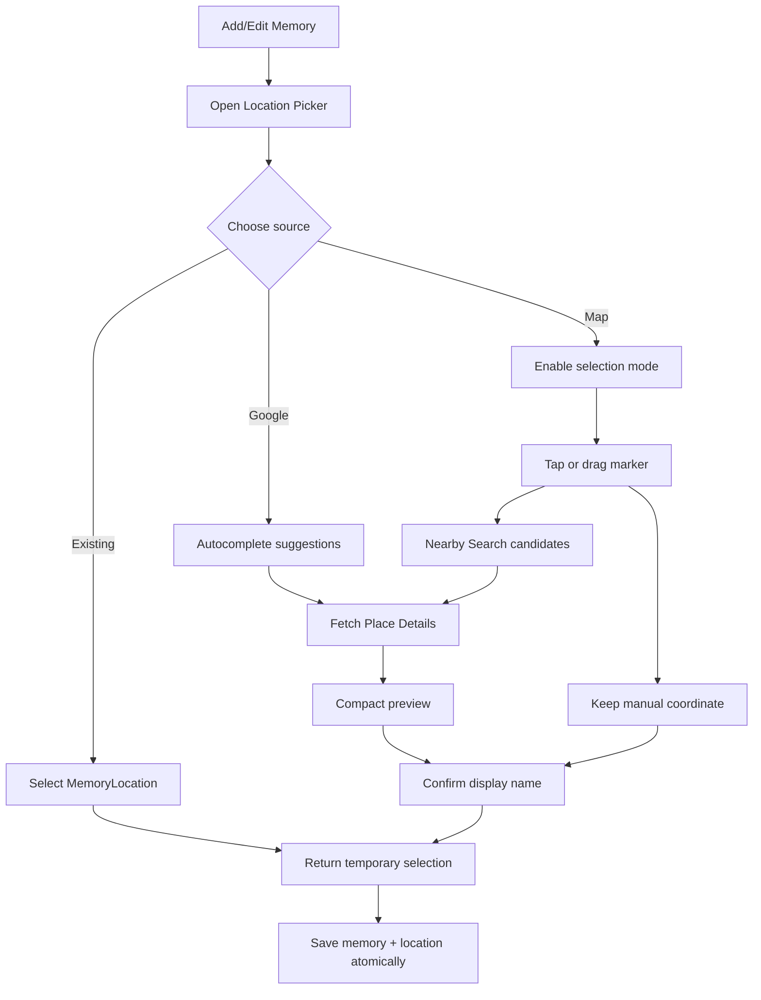

# Mình & Em - Mobile App Implementation Spec

Version: 1.3
Target: Flutter
Last updated: 2026-08-08
Design board: `love-journal-figma-handoff.html`
Time management extension: `love-journal-time-management-handoff.html`
Memory Composer handoff: `love-journal-memory-composer-handoff.html`
Home stage-1 handoff: `love-journal-home-living-journal-handoff.html`
Home preview: `love-journal-home-living-journal-preview.png`
Auth handoff: `love-journal-auth-handoff.html`
Auth preview: `love-journal-auth-preview.png`
Map/Memory Location design: [Figma - Love Journal Map + Memory Location](https://www.figma.com/design/b3zJU0jnS7ZFAaJNX6G5lC)
Current UI/UX source of truth: `love-journal-current-ui-ux.md`  
Token file: `love-journal-design-tokens.json`

## Product Intent

Important: this file contains the product and implementation spec across MVP and product-extension phases. For the UI/UX that is currently implemented in the Flutter app, read `love-journal-current-ui-ux.md` first.

`Mình & Em` is a private memory journal for a couple. The first release is a local-first anniversary gift app. The product direction later is a shared couple journal with sync, private letters, timeline, maps, reminders, and recap generation.

Core principle: this is not a photo gallery. It is a curated emotional archive.

## MVP Scope

Build these screens first:

1. Opening Gift
2. Home
3. Timeline
4. Memory Detail
5. Letters
6. Letter Detail
7. Three-Year Recap
8. Map

Post-MVP:

1. Add/Edit Memory
2. Account and partner invite
3. Cloud sync
4. Privacy lock
5. AI recap/export

Current product milestone:

1. Upgrade Timeline/Time into a memory management tab.
2. Add empty state for couples that have not written any memories yet.
3. Add create, edit, soft-delete flows for memories.
4. Replace fixed memory categories with data-driven tags.
5. Support moment voice messages and grouped image/video sections per memory.
6. Route user-facing app copy through localization resources.
7. Make Memory the owner of location selection and make Map a read-only projection of located memories.
8. Add an auth gate with Google/Firebase identity, backend-owned Email OTP and minimal account sign-out.

Current implementation note:

- The Flutter codebase has implemented the memory-owned location architecture and read-only Map projection.
- Bundled `assets/data/memories.json` and `assets/data/places.json` are intentionally empty so new memories/locations are created by the user instead of restored from hardcoded seed data.
- Google Places Autocomplete, explicit map selection with Nearby Search, compact Place Details, and lazy one-photo preview are implemented in Location Picker. The current local-first build uses Places API (New) REST through a platform-neutral data source, including on Android. Do not reintroduce Map search or hardcoded places.
- Native image/video selection, voice recording, persisted first-frame video thumbnails, full-screen media viewing, and controlled cover-video playback are implemented for the local-first Android flow.
- Auth presentation, Riverpod session state, GoRouter gate, Firebase/Google adapter, provisional Email OTP adapter and Home account sheet are implemented. Real Firebase values and backend OTP deployment are not stored in this repository and remain required before production login works.

## Navigation

Recommended structure:

```txt
AppRoot
  AuthGate
    SignInScreen
    EmailSignInScreen
    EmailOtpScreen
    OpeningGate
      OpeningGift
    MainTabs
      HomeTab
        HomeScreen
        MemoryDetailScreen
        RecapScreen
      TimelineTab
        TimelineScreen
        MemoryDetailScreen
        AddMemoryScreen
          LocationPickerScreen
        EditMemoryScreen
          LocationPickerScreen
      MapTab
        MapScreen
        LocationMemoryListSheet
        MemoryDetailScreen
      LettersTab
        LettersScreen
        LetterDetailScreen
```

Approved Location Picker routes:

```txt
/timeline/new-memory/location
/timeline/edit-memory/:memoryId/location
```

- Location Picker is pushed above Add/Edit Memory and does not show the bottom tab bar.
- Search, browse/select map mode, Nearby candidates, selected-place preview, manual coordinates, and naming are internal states of one picker screen.
- The picker returns a temporary `MemoryLocationSelection`; the form beneath remains the owner of unsaved memory state.

Opening logic:

- Require an authenticated session before Opening or the main shell.
- Show `OpeningGift` on first launch.
- Persist `hasSeenOpening = true` locally after CTA tap.
- Allow replay later from Settings or hidden debug menu.

## Authentication Implementation

### Ownership

- Firebase Authentication owns identity and session restoration.
- Google Sign-In is the first Android provider.
- The standalone backend owns Email OTP creation, delivery, expiry, attempts and rate limiting.
- Flutter owns presentation, local validation, challenge state, service adapters and router redirects.
- Partner/couple membership is not an auth custom claim and is not inferred after login.

### Flutter boundaries

```txt
features/auth/
  domain/entities + repository interfaces
  data/Firebase + HTTP + debug-only adapters
  application/AuthController + EmailOtpController + providers
  presentation/Sign In + Email + OTP + account components
```

Widgets never call Firebase or HTTP. `AuthController` publishes checking, signed-out and authenticated state plus Google/custom-token/sign-out operations. `EmailOtpController` owns request, code-sent, verify and resend states.

### Routes and redirect policy

```txt
/auth/sign-in
/auth/email
/auth/email/otp
```

- Signed-out users opening any journal route are redirected to Sign In.
- Signed-in users opening `/auth/*` continue through Opening or Home.
- A direct OTP route without an in-memory challenge shows a recoverable missing-challenge state and returns to Email.
- Sign-out changes provider state; GoRouter performs the redirect instead of the sheet manually navigating.

### Runtime config

Auth values are compile-time dart-defines loaded from an ignored JSON file. Required production fields are Firebase API key, Android app ID, messaging sender ID, project ID, Google Web OAuth/server client ID and the backend API base URL. No real value belongs in source control.

The checked-in `config/auth.dev.example.json` defines the accepted keys. `AUTH_DEV_BYPASS=true` is honored only in debug builds and uses OTP `123456`; release/profile always selects real adapters.

### Provisional Email OTP adapter

Until the backend publishes OpenAPI, Flutter provisionally calls:

```txt
POST /v1/auth/email-otp/request
POST /v1/auth/email-otp/verify
```

Request returns a challenge ID plus expiry/resend/attempt metadata. Verify returns `firebaseCustomToken`, which Flutter passes to Firebase Authentication. The released shared contract replaces this provisional response shape when available.

### Deferred auth-adjacent work

- Android Firebase console/OAuth/SHA setup and end-to-end Google verification.
- Backend OTP delivery and custom-token minting.
- iOS Firebase and Apple Sign-In.
- legal-content routes behind Terms/Privacy copy.
- UID-scoped local persistence, local-data migration and Partner onboarding.

## Design Tokens

Use `love-journal-design-tokens.json` as the source of truth.

Important values:

```txt
Base frame: 393 x 852
Safe top: 59
Safe bottom: 34
Screen horizontal padding: 20
Card radius: 8
Primary button height: 52
Secondary button height: 44
Icon button size: 40
Tab bar height: 64
```

Typography:

```txt
Display: Georgia or platform serif
Body: Inter or platform sans
Display XL: 44 / 44
Display L: 34 / 36
Title L: 26 / 29
Body M: 14 / 21
Body S: 12 / 16
```

## Localization

For the Flutter implementation, user-facing app copy should live in gen-l10n ARB resources instead of being hardcoded in widgets.

Current setup:

- `flutter_localizations` and `intl`.
- `l10n.yaml`.
- `lib/l10n/app_vi.arb` as the Vietnamese template locale.
- Generated `AppLocalizations` imported by the app.
- `context.l10n` extension for presentation widgets.

Rules:

- Keep route names, storage keys, JSON field names, asset paths, mock URIs, and other data contracts outside localization.
- Keep system tag labels localized in presentation from stable `MemoryTag.systemIdForCategory(...)` IDs.
- Custom tag names are user data and should be displayed as entered.

## Data Models

### Legacy Seed Memory

The current bundled JSON and Flutter entity use this flat location contract. Keep it readable during migration, but do not use it as the target editable contract.

```ts
type MemoryCategory =
  | "trip"
  | "birthday"
  | "daily"
  | "milestone"
  | "anniversary";

type RelationshipPhase =
  | "year_1"
  | "year_2"
  | "year_3";

type Memory = {
  id: string;
  title: string;
  date: string; // ISO date
  category: MemoryCategory;
  phase: RelationshipPhase;
  locationName?: string;
  latitude?: number;
  longitude?: number;
  placeId?: string;
  media: MemoryMedia[];
  coverMediaId?: string;
  story: string;
  favoriteMoment?: string;
  messageForHer?: string;
  voiceNoteUrl?: string;
  isFeatured?: boolean;
  createdAt: string;
  updatedAt: string;
};

type MemoryMedia = {
  id: string;
  type: "image" | "video";
  uri: string;
  width?: number;
  height?: number;
  alt?: string;
};
```

### Memory Management Extension

For the editable product version, do not keep `MemoryCategory` as a fixed enum in the core domain model. Keep the seed JSON compatible during migration, but introduce data-driven tags for user-created labels.

```ts
type MemoryTag = {
  id: string;
  name: string;
  color?: "rose" | "teal" | "moss" | "amber" | "lavender";
  isSystem?: boolean;
  createdAt: string;
  updatedAt: string;
};

type EditableMemory = {
  id: string;
  title: string;
  description: string;
  occurredAt: string;
  locationId?: string;
  note?: string;
  primaryTagId?: string;
  voiceMessages: MemoryVoiceMessage[];
  mediaGroups: MemoryMediaGroup[];
  coverMediaId?: string;
  isFeatured?: boolean;
  createdAt: string;
  updatedAt: string;
  deletedAt?: string;
};

type MemoryVoiceMessage = {
  id: string;
  uri: string;
  source: "imported" | "recorded";
  fileName?: string;
  title?: string;
  durationSeconds?: number;
  waveform?: number[];
  createdAt: string;
};

type MemoryMediaGroup = {
  id: string;
  title?: string;
  note?: string;
  items: MemoryMedia[];
  sortOrder: number;
};
```

Rules:

- `Tất cả` is not stored as a tag. It is a default UI filter.
- System tags can seed `Chuyến đi`, `Sinh nhật`, `Đời thường`, `Dấu mốc`, `Kỷ niệm`.
- Custom tags are created by the user and appear as new chips in Time.
- Start with one primary tag per memory for a simpler MVP. Multi-tag can be added later without changing the screen layout.
- Use soft delete with `deletedAt` first. Hard delete can be a later storage cleanup action.
- Location is optional and does not satisfy the meaningful-body validation by itself.

### Letter

```ts
type LetterStatus = "open" | "locked" | "opened";

type Letter = {
  id: string;
  title: string;
  occasion: string;
  preview?: string;
  body: string;
  unlockAt?: string; // ISO date
  status: LetterStatus;
  openedAt?: string;
  pinToHome?: boolean;
  coverStyle?: "rose" | "paper" | "night";
};
```

### Memory Location

```ts
type MemoryLocationSource = "googlePlaces" | "manual";

type MemoryLocation = {
  id: string;
  displayName: string;
  formattedAddress?: string;
  latitude: number;
  longitude: number;
  googlePlaceId?: string;
  source: MemoryLocationSource;
  createdAt: string;
  updatedAt: string;
};

type MemoryLocationSelection = {
  existingLocationId?: string;
  draftLocation?: Omit<MemoryLocation, "id" | "createdAt" | "updatedAt">;
};
```

Rules:

- `Memory.locationId` is the persisted relationship and Map grouping key.
- `displayName` is required and controlled by the user. A Google display name may prefill it but must remain editable.
- `formattedAddress` is optional display metadata.
- `googlePlaceId` identifies an external result and helps prevent duplicates; it is not the internal relationship key.
- A manually pinned location has no required `googlePlaceId`.
- There is no independent location note in this milestone. Private notes remain in `Memory.note`.
- A newly drafted location is persisted atomically with memory save. Canceling the picker or form persists nothing.
- If a selected Google result matches an existing `googlePlaceId`, return/reuse the existing location instead of creating a duplicate.
- Existing locations may be reused from the memory form; they are not created or managed from Map.

### Google Place Search

Google Places is an external discovery service used only by Location Picker. It is not the Map tab's data source and it does not own the user's display name.

```ts
type PlaceSearchSuggestion = {
  googlePlaceId: string;
  primaryText: string;
  secondaryText?: string;
  fullText: string;
};

type NearbyPlaceCandidate = {
  googlePlaceId: string;
  name: string;
  formattedAddress?: string;
  latitude: number;
  longitude: number;
  primaryTypeDisplayName?: string;
  businessStatus?: "operational" | "closedTemporarily" | "closedPermanently";
};

type PlacePhotoReference = {
  name: string;
  widthPx?: number;
  heightPx?: number;
  authorAttributions: Array<{
    displayName: string;
    uri?: string;
    photoUri?: string;
  }>;
};

type PlaceSearchResult = {
  googlePlaceId: string;
  name: string;
  formattedAddress?: string;
  latitude: number;
  longitude: number;
  primaryTypeDisplayName?: string;
  businessStatus?: "operational" | "closedTemporarily" | "closedPermanently";
  googleMapsUri?: string;
  photos: PlacePhotoReference[];
};
```

Rules:

- Autocomplete starts after at least two trimmed characters and a short debounce.
- Keep one session token from autocomplete through Place Details selection, then rotate it.
- Map interaction starts in browse mode. Pan/zoom/camera idle never mutate the draft and never call Places.
- Render map mode as a compact `Xem` / `Chọn vị trí` segmented control. Do not place a long status sentence beside it; contextual guidance belongs in the bottom panel.
- Keep reset as an independent icon action and show it only when a marker exists.
- Enabling `Chọn vị trí` allows map tap and marker drag-end to create a temporary manual coordinate.
- Give Google Places Search its own `FocusNode`. Focus must hide the bottom context panel immediately; `MediaQuery.viewInsets` remains a fallback for keyboard activation through other input paths.
- Set `resizeToAvoidBottomInset: false` only for the search/map step. Choose and Name retain normal resize behavior, and Name remains scrollable with its autofocus keyboard.
- Unfocus must restore the previous bottom panel without resetting the selected place, marker, transient photo, query, or picker draft.
- Each explicit coordinate runs Nearby Search with a 150 meter radius, `DISTANCE` ranking, all types, and at most 8 results.
- Nearby results render as tappable markers and a synchronized list.
- Fetch Place Details only after an Autocomplete suggestion or Nearby candidate is selected.
- Nearby-selected Place Details must omit the Autocomplete session token.
- Place Details requests compact fields only; the first photo is fetched lazily after selection.
- Photo bytes and dynamic place metadata remain transient and are never serialized into `MemoryLocation`.
- A slower response from an earlier search, map tap, Details request, or photo request must not overwrite newer state.
- Manually moving a Google-backed selection clears `formattedAddress`, `googlePlaceId`, and selected Google metadata before Nearby Search starts.
- Selecting a result creates only a temporary picker draft until the memory is saved.
- Autocomplete failure keeps the query visible. Nearby failure keeps the selected coordinate and manual-save action available.
- Current Flutter search models call the external identifier `placeId`; map or rename it to `googlePlaceId` at the Google Places boundary so it cannot be confused with internal `locationId` or legacy seed `placeId`.
- Do not commit Google Maps API keys.
- The current direct REST implementation is temporary and requires an application-unrestricted key; it must move behind a backend/proxy before production.
- The app must keep a no-key fallback state so local development and automated tests can run without secrets.

Current Android implementation:

- Package/application id: `vn.hung.le.lovejournal`.
- Debug SHA-1 used for restriction: `9A:27:5D:11:3E:A1:38:DC:CC:25:39:D8:D3:7E:00:A1:94:34:5F:A0`.
- `GooglePlacesApiDataSource` owns Autocomplete, Nearby Search, Place Details, Place Photos, 50 km autocomplete bias, session-token reuse, field masks, and structured HTTP errors.
- Nearby Search is called only from explicit map tap or marker drag-end; it is never tied to camera movement.
- Place photo responses are held in memory for the selected preview and include visible author attribution when Google returns it.
- REST requests send only Web Service-supported authentication headers; they do not send Android package/certificate or iOS bundle headers.
- Cloud checks confirmed active billing, API enablement, and project ownership. The same key succeeds against Places API (New) REST from Cloud Shell but receives `403 PERMISSION_DENIED` from the local host and Android device.
- Key metadata confirms a standard key with no application restriction and only the required Places/Android Maps API targets. The linked payments profile country is Vietnam.
- Minimal and full request variants fail identically outside Cloud Shell, ruling out field mask, query, session token, and location bias as the source of the denial. Forced IPv4 and IPv6 requests from the local Windows host are both denied.
- A native Places SDK bridge returned `9011 REQUEST_DENIED` on-device and is not part of the current runtime path.
- On 2026-07-21, a replacement local key returned HTTP `200` with five Autocomplete suggestions from the same Windows host. The debug APK built successfully and its merged manifest contained the replacement key.
- This resolves the Flutter request-path question but not production eligibility: Google's current Maps Platform Prohibited Territories list includes Vietnam. Billing country must reflect the real billing address, and production distribution requires a compliant provider decision.

### Legacy Place Compatibility

The current implementation still has `Place`, `PlaceDto`, `JournalData.places`, and `assets/data/places.json` for backward compatibility. `assets/data/places.json` is intentionally empty in the current repo and must not be treated as the product-owned marker source.

Migration rules:

- Continue reading flat `locationName`, `latitude`, `longitude`, and current `placeId` from seed memories.
- Current `placeId` values identify bundled `Place` records; never assume they are Google Place IDs.
- Create stable internal `MemoryLocation.id` values for migrated places and update memories with `locationId`.
- Preserve coordinates and user-visible names while migrating.
- Map markers now come from visible memories joined to `MemoryLocation`, not directly from `places.json`.

## Components

Create these before composing screens:

```txt
AppScaffold
StatusBarSpacer
TopBar
IconButton
PrimaryButton
SecondaryButton
BottomTabBar
FilterChip
HeroMemoryCard
StatCard
MemoryListCard
TimelineSpine
LetterCard
LockedLetterBadge
PlacePreviewSheet
VoiceNotePlayer
MediaCarousel
MemoryVideoThumbnail
MemoryVideoPlayer
MemoryMediaViewer
QuoteBlock
MemoryEmptyState
MemoryActionMenu
MemoryFormField
MemoryTagSelector
MomentMessageField
VoiceMessageSourceSheet
VoiceRecorderSheet
VoiceMessageListItem
MediaGroupEditor
MediaAddSourceSheet
MediaItemMenu
PhotoUploadField
TextField
```

## Screen Specs

### OpeningGift

Purpose: make the first app launch feel like opening a private gift.

Content:

- Full-screen vertical image/video background.
- Gradient overlay from transparent top to strong dark bottom.
- Kicker: `Gửi riêng em`.
- Title: `Ba năm, mình vẫn ở đây.`
- Body copy: short personal message.
- CTA: `Mở món quà`.

Behavior:

- On mount: background slow zoom 900ms.
- Text fade/stagger 120ms.
- CTA appears after text.
- On tap: persist `hasSeenOpening`, navigate to MainTabs/Home.

### Home

Purpose: the living front page of the journal, not a utility dashboard.

Implementation status:

- Stage 1 implemented.
- Source: `lib/src/features/journal/presentation/screens/home_screen.dart`.
- Components: `lib/src/features/journal/presentation/components/home_components.dart`.
- Visual handoff: `docs/designs/love-journal-home-living-journal-handoff.html`.

Sections:

- Header: `Chào em` + `Mình & Em`; heart opens Recap.
- Living hero:
  - 334px high;
  - featured memory, falling back to the first visible memory;
  - love-day count, memory title, date, and place;
  - static image or video thumbnail;
  - tap opens Recap.
- Stats ribbon:
  - love days;
  - `visibleMemories.length`;
  - `mapLocationGroups.length`.
- Recent discovery PageView:
  - copy visible memories;
  - sort by date descending, then `updatedAt` descending;
  - remove the hero memory;
  - take at most five;
  - card tap opens Memory Detail.
- Compact letter section:
  - use `nextHomeLetter(now)`;
  - preserve locked/opened state label;
  - tap opens Letter Detail.
- Recap band: entire surface opens Recap.
- Bottom tabs remain owned by `MainNavigationShell`.

Rules:

- Hero media must be visually dominant.
- Keep copy short.
- Home should always have a clear next action.
- Video media in stage 1 must use `MemoryVideoPreview(showPlayIcon: false)` and must not initialize `MemoryVideoPlayer`.
- Location statistics must not use legacy `JournalData.places`.
- Fixed-height media surfaces must cap and ellipsize text without resizing the layout.
- Components must be separated from screen-level data orchestration.

Empty state:

- When `featuredMemoryOrNull == null`, use `AppAssets.heroImage`.
- Hide the recent-memory PageView.
- Show `Tạo kỷ niệm đầu tiên`.
- Route the CTA through `AppRouteNames.timelineAddMemory`.
- Letter and Recap sections remain available.

Motion and accessibility:

- `HomeScreen` is stateful and owns one shared entrance `AnimationController`.
- Entrance duration is 760ms with staggered intervals and the existing soft curve.
- PageView cards may scale and translate slightly based on distance from the active page.
- Read `MediaQuery.disableAnimations`.
- When disabled animations are requested:
  - set entrance progress directly to 1;
  - do not apply PageView distance transforms;
  - do not introduce a replacement looping animation.

Stage 2, not yet implemented:

- Daily-memory selector.
- Hero parallax.
- Count-up statistics.
- Featured-memory priority in the recent carousel.
- Muted hero-video autoplay with offstage and navigation lifecycle control.

### Timeline

Purpose: browse memories chronologically.

Sections:

- Header.
- Category chips.
- Phase/year label.
- Timeline spine list.

Behavior:

- Filter chips update list in place.
- Memory tap pushes `MemoryDetailScreen`.
- Scroll reveal: opacity 0 to 1, translateY 8px to 0.

Current product extension:

- Rename visible tab title to `Time` while keeping the kicker `Theo dòng thời gian`.
- Add search and add actions in the header.
- `Tất cả` is always the first chip.
- All other chips come from `MemoryTag` data, including user-created custom tags.
- Empty state when there are no memories at all:
  - Title: `Chưa có kỷ niệm nào được viết`
  - Body: `Bắt đầu bằng một khoảnh khắc nhỏ. Một buổi tối bình thường cũng xứng đáng được giữ lại.`
  - CTA: `Thêm kỷ niệm đầu tiên`
- Empty filtered state when the selected tag has no memory:
  - Title: `Chưa có kỷ niệm trong nhãn này`
  - Body: `Bạn có thể thêm một kỷ niệm mới vào nhãn đang chọn.`
  - CTA: `Thêm vào nhãn này`
- Memory card should show cover thumbnail, title, date/place, short description, primary tag, media summary, and overflow action menu.
- Overflow action menu should include edit, feature/unfeature, and soft delete.

### Add/Edit Memory

Purpose: create or update one curated memory through a visual composer without making the app feel like a generic form or gallery manager.

Route:

- `AddMemoryScreen`: pushed from Time header and empty state CTA.
- `EditMemoryScreen(memoryId)`: pushed from memory overflow menu.
- `LocationPickerScreen`: pushed from the Location field in either form and returns a temporary selection.
- These routes should not show the bottom tab bar.

Sections:

- Composer header with close, autosave state, and editable generated title.
- Compact metadata chips for date, one primary tag, and optional location.
- Date selection uses a fixed-size 42-cell month sheet with direct previous/next state updates; avoid the default date-picker month transition in this flow.
- Empty-canvas prompt with three entry actions: media, story, voice.
- One expanding story field. When migrating an existing memory, append legacy `note` to `story` once for editing.
- `Lời nhắn cho khoảnh khắc này` supports imported audio and recorded voice, maximum 3 messages.
- Media groups:
  - User can add groups dynamically.
  - MVP maximum is 3 groups per memory.
  - Each group has an optional persisted `title`; UI falls back to `Đoạn x` for legacy/null values and allows direct editing.
  - Each group has an optional note at the top.
  - Each group can contain images and videos mixed together.
  - Each group preserves sort order.
- Persistent composer toolbar:
  - Repeat media, story, and voice actions.
  - Primary CTA: `Lưu kỷ niệm`.
  - Disable save until story, voice, image, or video exists.
  - Show submitting state while repository persistence is running.

Title and draft rules:

- Manual title override wins.
- Otherwise use first story line, then location display name, then tag/date.
- Date defaults to today and tag defaults to `Đời thường`.
- Location alone is not meaningful content.
- Persist `MemoryComposerDraft` separately from the journal data draft with debounce autosave.
- Flush on close/back, offer resume/discard on reopen, and delete the draft only after successful memory save.

Attachment boundary:

- Presentation depends on `MemoryAttachmentService`, not picker plugin APIs.
- Device implementation uses `image_picker`, `file_picker`, `record`, and `path_provider`.
- Copy selected/recorded files into app-owned documents storage before putting their paths in immutable draft state.
- Non-IO targets use a stable no-op adapter until product-specific browser storage is designed.
- Use `video_player` behind reusable presentation components only for requested playback; Android minimum SDK is 24.
- Use `video_thumbnail_gen` during import to create one app-owned first-frame JPEG per video. Persist its path as nullable `MemoryMedia.thumbnailUri`; legacy records without it may extract a thumbnail at runtime as a compatibility fallback.
- Thumbnail rails must render static images and must not initialize one `VideoPlayerController` per visible tile.
- Opening the media viewer must not mutate or discard the current composer draft.
- Video selection uses a multi-file picker and accepts only the remaining slots within a hard 3-video-per-memory limit.
- The attachment service reports import progress after selection. Presentation shows a non-dismissible modal loading surface before awaiting the picker result so native caching and app-storage copying cannot look frozen.
- The controller re-applies the 3-video limit before mutating immutable draft state; UI/picker checks are not the only guard.

Location UX:

- Do not keep Location as a plain text field in the target implementation.
- Empty form state shows location as optional with `Thêm địa điểm`.
- Selected form state shows `displayName`, optional address, and change/remove actions.
- Location Picker begins with two choices:
  - reuse an existing `MemoryLocation`;
  - find or pin a new location.
- New location discovery supports:
  - Google Places Autocomplete suggestions;
  - compact Place Details after suggestion selection;
  - one lazily loaded photo, visible attribution, business status, and Google Maps link when available;
  - a compact `Xem` / `Chọn vị trí` segmented map mode control with a conditional reset icon;
  - direct map tap or marker drag-end without tying the location to camera movement;
  - Nearby Search candidates shown as both markers and a list;
  - manual pin fallback without using Google search;
  - required user-confirmed display name.
- If no Maps key is available, show a stable explanation and allow back/cancel. Do not crash or commit a partial location.
- Search focus hides the contextual lower panel before keyboard animation and keeps the search/suggestion surface anchored at the top.
- Closing the keyboard restores the lower panel with the previous selection intact.
- Back/cancel returns no result and preserves the form's previous location selection.
- Remove clears the form's temporary `locationId`/location draft; persistence changes only on memory save.

Location flow:



Lời nhắn UX:

- Do not render a separate `Audio` field. The feature label is always `Lời nhắn cho khoảnh khắc này`.
- This section can attach audio from the device or record a new voice message.
- The field must not render a fake fixed player when there is no message.
- Empty state:
  - Title: `Chưa có lời nhắn`
  - Helper: `Ghi âm mới hoặc chọn một đoạn audio có sẵn trong máy.`
  - Actions: `Chọn từ máy`, `Ghi âm`
- `Chọn từ máy` opens a bottom sheet first, then a system file picker.
  - Supported formats for MVP: mp3, m4a, wav.
  - After import, show a message row with play action, title/file name, waveform placeholder, duration, and overflow menu.
- `Ghi âm` opens an in-app recorder screen or bottom sheet.
  - States: idle, recording, paused, preview, saving, error.
  - Recording UI should show timer, live waveform/progress, pause/resume, cancel, and save.
  - After recording, user can preview and optionally rename before saving into the memory.
- Multiple voice messages are allowed. MVP should limit to 3 messages per memory.
- Voice message item menu:
  - Rename.
  - Replace file.
  - Delete from this memory.
- Permission states:
  - If microphone permission is denied, show explanation and a settings CTA.
  - If file picker is unavailable, show a retry/error state.

Media group UX:

- Media groups are not a plain gallery grid. Each group is a story segment.
- Media groups are created by user action, not fixed in the UI.
- Empty state:
  - Title: `Chưa có nhóm media`
  - Helper: `Tạo nhóm đầu tiên rồi thêm ảnh/video vào đoạn câu chuyện đó.`
  - CTA: `Thêm nhóm media`
- Show a group counter such as `0/3 nhóm`, `1/3 nhóm`, `3/3 nhóm`.
- When the memory reaches 3 groups, disable or hide the add-group CTA.
- Every group card should include:
  - Drag handle or reorder affordance.
  - Runtime group label, for example `Nhóm media · 1/3`.
  - Optional note field at the top.
  - Mixed image/video grid.
  - Add media tile.
  - Group actions menu.
  - Small footer with item count and reorder hint.
- Add media tile opens a source menu:
  - `Thêm ảnh từ thư viện`.
  - `Thêm video từ thư viện`.
  - `Chụp hoặc quay mới`.
- Each media item should have an overflow menu:
  - Move to cover.
  - Move to another group.
  - Delete from group.
- Group action menu:
  - Rename group label later if needed.
  - Duplicate group later if needed.
  - Delete group.
- Reorder rules:
  - Items can be reordered inside one group.
  - Groups can be reordered relative to each other.
  - `sortOrder` must be persisted for both groups and items.
- Empty group rules:
- Empty groups can exist during editing.
- Empty groups are not saved unless they contain a note.
- If a group contains only a note, it can be saved as a story break.
- User cannot create a fourth group in MVP.
- Current media-preview behavior:
  - every video item renders its own static first-frame thumbnail plus a play affordance;
  - tapping an image/video opens a full-screen viewer at that item;
  - the viewer pages within the current group, supports image zoom, and exposes video play/pause without seeking;
  - starting a video pauses any other active memory video to prevent overlapping audio.
  - video count is global to the memory, not reset per group; at most 3 video items may exist across all groups;
  - multiple selected videos are copied sequentially with visible `x/n` feedback, while files beyond the remaining slots are not copied;

Validation:

- Title is generated when there is no explicit override.
- Date defaults to today and remains required in the persisted model.
- At least one of story, voice message, image, or video should exist.
- Media group can be empty only while the user is editing; empty groups should not be saved.
- New custom tag names should be trimmed and de-duplicated case-insensitively.
- Imported voice message must have a readable local URI or uploaded remote URI before final save.
- Recorded voice message must be saved to local app storage before being attached to the memory.
- A new location requires a non-empty trimmed `displayName` and valid finite coordinates.
- Latitude must be between `-90` and `90`; longitude must be between `-180` and `180`.
- Existing `locationId` must resolve before memory save; otherwise show an inline error and keep the form open.

Deletion:

- Use an action menu or confirmation sheet, not a bare destructive icon.
- First implementation should soft delete with `deletedAt`.
- Show a clear destructive label: `Xóa kỷ niệm`.
- Later product can add undo or trash recovery.

### MemoryDetail

Purpose: let one memory breathe.

Sections:

- Cover media.
- Back/favorite actions.
- Detail sheet: date, place, title, story.
- Quote block: favorite moment.
- Voice note optional.
- Gallery strip.

Rules:

- Avoid long dense paragraphs.
- Split long story into short blocks if over 600 characters.
- Voice note should show duration even if playback is not implemented yet.
- Image cover tap opens the full-screen viewer.
- A video cover uses a real player and automatically plays exactly 3 completed runs unless the user pauses it.
- After the third automatic run, the cover remains stopped. Subsequent manual Play starts from the beginning and stops after one run; automatic looping never resumes for that screen instance.
- Cover and viewer video controls expose play/pause only. Do not expose a seek bar in this milestone.
- Media-rail items open the viewer at the selected index; videos use their own persisted first-frame thumbnails.

### Map

Purpose: turn memories into a journey.

Previous Flutter state (removed):

- Real map surface uses `google_maps_flutter`.
- Place search uses Google Places Web Service through a repository/data-source boundary.
- Saved places from bundled JSON render as map markers.
- A warm static canvas remains as a fallback when no platform Maps key is configured.

This transitional UI has been removed. Search in Map and bundled JSON marker ownership are not the product model.

Current implemented behavior:

- Map has no search, add, edit, or standalone place management controls.
- Select visible memories where `deletedAt == null` and `locationId != null`.
- Join those memories to `MemoryLocation` and group by internal `locationId`.
- Render one marker per group using the location coordinates.
- Marker tap opens `LocationMemoryListSheet` with the user-defined location name, optional address, and all visible memories in the group.
- Present `LocationMemoryListSheet` through the root navigator. Its route, barrier, and safe-area content must render above `MainNavigationShell` and the persistent tab bar.
- Memory row tap opens Memory Detail through the Map branch.
- Memories without a resolvable location or valid coordinates do not render.
- Empty projection shows an emotional empty state with a CTA to Time/Add Memory.
- Recenter frames all visible markers; for one marker, use a closer zoom.
- The Map screen watches journal state and does not own a second mutable list of places.

Projection consistency:

- Creating a located memory adds it to a marker group.
- Changing `locationId` moves it between groups.
- Clearing `locationId` removes it from Map.
- Soft delete excludes the memory immediately.
- A marker disappears when its last visible memory is removed or soft-deleted.
- Location records with no visible memories may remain in storage for reuse but never render on Map.

Configuration:

- Android injects `GOOGLE_MAPS_ANDROID_API_KEY` through a manifest placeholder. During local REST testing the key must have Application restriction `None`; keep its API restrictions limited to `Maps SDK for Android` and `Places API (New)`.
- iOS injects `GOOGLE_MAPS_IOS_API_KEY` through `Info.plist`/build settings. Use a Google Cloud key restricted to bundle id `vn.hung.le.lovejournal`.
- Places calls currently use `GooglePlacesApiDataSource`; the key is attached to HTTPS requests in Dart for this local-first milestone.
- The platform-neutral `PlaceSearchDataSource` contract allows the REST client to be replaced by a backend implementation without changing application or presentation layers.
- Enable `Places API (New)` and include it in API restrictions in addition to the relevant platform Maps SDK.
- Places calls are made only by Location Picker. Map tab rendering uses the Maps SDK key but never calls Autocomplete, Nearby Search, Place Details, or Place Photos.
- Before production, move Places requests behind a backend/proxy and restore a separate Android package/SHA-1-restricted key for native Maps rendering.

Verification status:

- The old key remained source-dependently denied outside Cloud Shell, but the replacement key passes REST Autocomplete from Windows. The debug APK build passes with the replacement key injected into its manifest.
- On-device Autocomplete, Nearby Search, Place Details, and Place Photos need a fresh verification after this interaction update. Production must not rely on a billing-country workaround that conflicts with the real billing address or Maps Platform territory terms.

### Letters

Purpose: private time capsule.

States:

- `open`: readable now.
- `locked`: countdown only, no body preview.
- `opened`: readable, marked as opened.

Behavior:

- Tap open letter pushes `LetterDetailScreen`.
- Tap locked letter opens bottom sheet explaining unlock date.

### LetterDetail

Purpose: slow reading moment.

Content:

- Back and favorite actions.
- Envelope visual.
- Occasion.
- Title.
- Letter body.
- Optional next/read more CTA.

Motion:

- Envelope unfold.
- Paper reveal.
- Body text fade in.

### Three-Year Recap

Purpose: final emotional peak.

Content:

- Recap hero image.
- Stats: days, cities/places, photos, letters.
- Final quote.
- CTA: `Cùng anh viết tiếp nhé?`

Behavior:

- Can be linked from Home.
- Can be shown after Opening for anniversary day.
- Later product: export/share recap.

## Motion

Use these defaults:

```txt
Fast: 160ms
Base: 260ms
Slow: 520ms
Ritual: 900ms
Curve standard: cubic-bezier(0.2, 0.8, 0.2, 1)
Curve soft: cubic-bezier(0.16, 1, 0.3, 1)
```

Motion rules:

- Do not animate every element.
- Use slow motion only for emotional moments: Opening, Letter, Recap.
- Respect reduced motion settings.
- Use shared element transition for memory cover if practical.

## Local-First MVP Storage

Recommended simple setup:

```txt
assets/
  data/
    memories.json
    letters.json
    places.json # empty legacy-compatible asset
  images/
  audio/
```

Persist only:

```txt
hasSeenOpening
openedLetterIds
favoriteMemoryIds
lastViewedMemoryId
journalDataDraft.v2 # memories, tags, locations, and current editable draft data
```

Implemented local-first persistence extension:

- `journalDataDraft.v2` stores `MemoryLocation` records and memory `locationId` references.
- Legacy seed place links remain readable for migration compatibility, but runtime Map marker ownership no longer depends on `places.json`.
- One controller/repository save path commits a new location together with the memory.

Later product:

- Move data to SQLite/Isar/Realm.
- Add sync layer.
- Scope local data by authenticated UID and couple space.
- Add partner pairing as a separate post-auth flow.

## Seed Data Checklist

Current repo state:

- `assets/data/memories.json` is `[]`.
- `assets/data/places.json` is `[]`.
- New memories and locations should be created through the app instead of hardcoded into bundled seeds.

For a later curated anniversary gift content pass, prepare:

- 20-30 memories.
- 8-12 places.
- 3-5 letters.
- 1 final recap message.
- 1 voice note for the strongest memory.
- 1 vertical hero image/video for opening.
- 1 app icon.

Each memory should have:

```txt
title
date
locationId optional, with a matching `MemoryLocation`
category
1-5 photos
story
favoriteMoment
messageForHer optional
```

## Quality Checklist

Before giving the app:

- App opens offline.
- All local images load.
- No debug labels.
- Opening appears on first launch only.
- Letter lock dates are correct.
- Timeline sorted correctly.
- Love day counter is correct.
- Back navigation works everywhere.
- Text does not overflow on small devices.
- App icon and name are polished.
- No accidental private/dev content in release build.
- Signed-out users cannot reach the journal shell through a deep link.
- Missing Firebase/backend config produces an inline recoverable error, not a fake session or crash.
- Google loading prevents duplicate auth requests; cancel keeps local data intact.
- Email and OTP validation, resend countdown, invalid/expired/rate-limit/offline states remain inline.
- Auth session survives app restart after real Firebase setup; sign-out returns to Sign In.
- `AUTH_DEV_BYPASS` cannot activate in profile/release builds.
- Location Picker cancel does not persist a location.
- Google Places search is visible only in Location Picker.
- Map has no add/search/edit place controls.
- Map markers and counts match visible located memories after create, edit, remove-location, and soft-delete actions.
- Missing Maps key states do not crash Map or Location Picker.
- Composer and Memory Detail video tiles render the correct static first-frame thumbnail for every video in a segment.
- Image/video taps open the viewer at the correct item in both editing and read-only flows.
- Cover video stops after 3 completed automatic runs, then manual replay runs once without seeking.
- Multi-video picker never persists more than the remaining slots under the 3-video-per-memory limit.
- A loading overlay is visible while large/multiple selected videos are prepared and copied into app-owned storage.

## Implementation Recommendation

If deadline is close:

1. Build with local JSON and bundled assets.
2. Use the debug-only auth bypass for UI demos; never ship it as production authentication.
3. Use static map if map SDK setup is risky.
4. Add only one polished animation: Opening to Home.
5. Make Memory Detail and Letters emotionally strong.

For product version:

1. Connect Firebase and publish the backend Auth/Couple OpenAPI contract.
2. Add partner invite and local-data migration.
3. Move editable data to a sync-ready local database.
4. Add cloud media storage and synchronization.
5. Add privacy lock and recap/export hardening.
